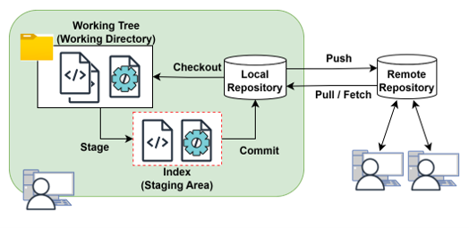
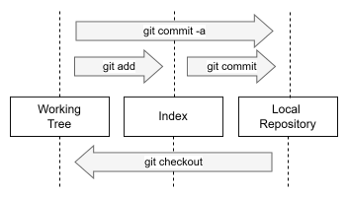
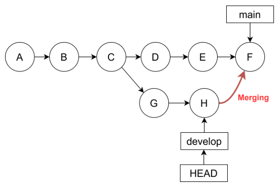
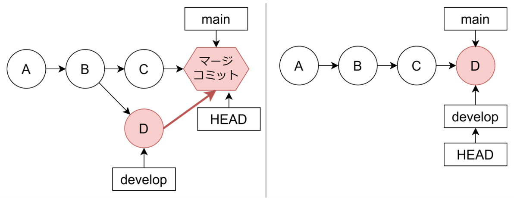
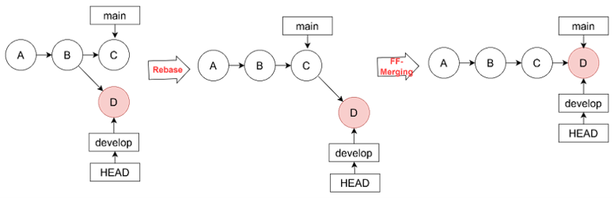
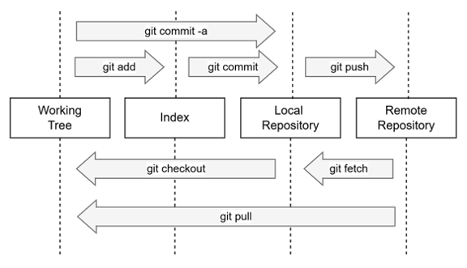

# Git Tutorial

## 1. What is Git?

Gitは分散型バージョン管理システムである。バージョン管理システムとは、ソースコードの変更履歴を管理するツールである。過去の状態を復元したり、複数人で協力して開発を進めたりすることができる。

Gitの特徴は「分散型」である。開発者はローカルリポジトリで自由に開発を進め、必要に応じて、リポジトリを同期してチームメンバと変更を共有することができる。

もう一つの重要な特徴は、ファイルの状態を「スナップショット」として保存する仕組みである。各スナップショットは「コミット」と呼ばれ、一意なハッシュ値で識別される。コミットはツリー構造で保存され、リポジトリ間で同期して共有される。これにより、変更履歴の追跡や他人の変更の取り込みが容易となる。


### Gitの仕組み

### 

3つの管理エリア

* Working Tree（作業ディレクトリ）：変更作業を実際に行うディレクトリ
* Index（ステージングエリア）：コミットする変更を準備する場所
* Repository: 変更履歴を保存する場所


変更の共有

1. Working Treeでファイルを編集する
2. 変更をIndexに追加する（Stage）
3. ステージングされた変更をリポジトリに記録する（Commit）
4. 変更をリモートリポジトリに共有する（Push）


変更の取得

1. リモートリポジトリから変更を取得する（Pull / Fetch）
2. 取得した変更をWorking Treeに反映する（Checkout）


### Gitのセットアップ

1. インストール
   
   Linuxの場合：
   
   ```
   sudo apt install git
   ```
   
   Windowの場合：
   
   　[Git公式サイト](https://git-scm.com/downloads)からインストーラをダウンロード
   
2. 初期設定
   ```
   # ユーザー設定
   git config --global user.name "Your Name"
   git config --global user.email "your.email@example.com"
   
   # コミットメッセージ編集用のエディタ設定
   git config --global core.editor '<editor name>''
   ```

   ※ editor nameには例えば以下が指定可能

   * ```nano```
   * ```vim```
   * ```emacs```
   * ```code --wait``` (VS code)
   * ```gedit --wait``` (Gedit)


## 2. Git Basic Workflow

本章では、ローカルリポジトリでの基本的な操作について説明する。


### 2.1 リポジトリを準備する

* 新規にリポジトリを作成する

```
git init
```

### 2.2 変更を追加する

* 変更をステージングエリアに追加する

```
# 指定ファイルの変更をステージングエリアに追加する
git add <file>

# 全ての変更をステージングエリアに追加する（未追跡ファイルは対象外）
git add .
```

* 変更をリポジトリに記録する

```
# エディタが開くので、コミットメッセージを入力する
git commit

# コミットメッセージを指定して、コミットする
git commit -m "Commit Message"

# addとcommitを同時に行う（未追跡ファイルは対象外）
git commit -a -m "Commit Message"
```

### 2.3 変更を表示する

* 作業ディレクトリとステージングエリアの状態を表示する

```
git status
git status -s  # 短縮バージョン
```

* コミット履歴を表示する

```
git log
git log --oneline         # 1行で表示
git log --graph --oneline # グラフ形式で表示
```

* ファイルの変更差分を表示する

```
git diff
```

### 2.4 変更を取り消す（復元操作）

* コミットやステージングした変更を取り消す

```
# ステージングした変更を取り消す(ファイル指定のない場合は全ての変更を取り消す)
git checkout -f [<file path>]

# --mixed（デフォルト）：コミットとステージングを取り消し、変更は作業ディレクトリに残す
# --soft：コミットのみを取り消し、変更はステージングされた状態で残す
# --hard：コミットとステージング、作業ディレクトリの変更をすべて取り消す
git reset <commit id>
git reset --soft <commit id>
git reset --hard <commit id>
```

### 2.5 Try Hands-on Exercise



```bash
# リポジトリを作成する
$ mkdir ~/Desktop/repo
$ cd ~/Dekstop/repo
$ git init .

# 変更をリポジトリに記録する（１回目）
# (Edit files)
$ touch hello.txt
$ git status  # --> Untracked filesにhello.txtが表示される
On branch master
No commits yet
Untracked files:
        hello.txt

# (Stage)
$ git add hello.txt
$ git status  # --> Untracked filesにいたhello.txtがステージングエリアに移る
On branch master
No commits yet
Changes to be committed:
        new file:   hello.txt

# (Commit)
$ git commit -m "Add hello.txt"
$ git status         # --> 何も表示されなくなる
$ git log --oneline  # --> 先ほどの追加が表示される
aaa1111  (HEAD -> master) Add hello.txt

# 変更をリポジトリに記録する（２回目）
# (Edit files)
$ echo "hello" >> hello.txt
$ git status         # --> 未ステージファイル欄に変更したファイルが表示される
On branch master
Changes not staged for commit:
        modified:   hello.txt
$ git diff  # --> 変更差分が表示される
diff --git a/hello.txt b/hello.txt
    ...
+hello

# (Stage & Commit)
$ git commit -a -m "Update hello.txt"
$ git log --oneline
bbb2222 (HEAD -> master) Update hello.txt
aaa1111 Add hello.txt

# 2回目の変更を取り消す(mixedで消すと変更は作業ディレクトリに、hardで消すと完全に抹消)
$ git reset aaa1111  # 復元ポイントのコミットIDを指定する
$ git diff  # --> 先ほどコミットした変更が作業ディレクトリに戻っている
diff --git a/hello.txt b/hello.txt
    ...
+hello

$ git log --oneline  # --> 1回目の変更状態に戻っている
                     # (ただし、mixed resetなので、変更は作業ディレクトリに残っている)
aaa1111  (HEAD -> master) Add hello.txt

$ git commit -a -m "Update hello.txt"
$ git log --oneline                        #   hashは一意なので
ccc3333 (HEAD -> master) Update hello.txt  # ★同じ変更でも別のhash値が付与される
aaa1111 Add hello.txt
```


## 3. Branch, Merging and Tag

ソフトウェア開発では、複数のメンバーが同じファイルに対して同時に変更を加えることがある。また、複数のリリースバージョンを並行して保守する必要もある。このような並行作業を支援するため、ブランチという機能がある。

ブランチとは、開発の流れを分岐させる機能である。通常、リポジトリにはメインブランチ（mainブランチ / masterブランチ）が存在し、プロジェクトの主要な開発ラインを表す。変更を加えるときは開発ブランチを分岐させて、新機能や修正のための変更をそこで行い、作業を完了したらメインブランチにマージする。マージでは、異なるブランチの変更を一つにまとめる操作が行われ、これにより分岐していた開発作業がメインストリームに反映される。また、リリース時にはリリースブランチが作成され、特定のバージョンの保守がそこで継続される。

Gitでは、ブランチはコミットの系列を指し示すポインタである。ブランチの作成や切替を軽量で迅速に行うことができるため、開発者は頻繁にブランチを作成し、マージすることが推奨される。また、Gitにはブランチに加えて、HEADとタグという機能が存在する。HEADは現在作業中のコミットを指し示すポインタであり、次のコミットの起点となる。タグはコミットにラベルを付ける機能であり、リリースバージョンや重要なマイルストーンに印をつけるために使用される。



### 3.1 ブランチを操作する

* ブランチを作成、確認、削除する

```
# ブランチを一覧表示する（現在のブランチに＊印）
git branch

# ブランチを作成する
git branch <branch name>
git branch <branch name> <commit id>  # 指定コミットから分岐させる

# ブランチを削除する
git branch -d <branch name>

# ブランチ名を変更する
git branch -m <branch name> <new branch name>

# 強制的にブランチを作成する（同名のブランチは削除される）
git branch -f <branch name>
```

* ブランチを切り替える

```
# ブランチを切り替える
git checkout <branch name>

# ブランチを作成して、切り替える
git checkout -b <branch name>
git checkout -b <branch name> <commit id>  # 指定コミットから分岐させる

# 強制的にブランチを作成して、切り替える（同名のブランチは削除される）
git checkout -B <branch name>
```

※最新のgitでは、checkoutの役割が広すぎるため、```git switch```と```git restore```が導入されており、
　ブランチの切り替えには```git switch```が推奨されつつある


### 3.2 ブランチをマージする

**<u>通常のマージ</u>**

```
git checkout <main branch>
git merge <target branch>
```

* Non Fast-forward マージ (Non FF Merging)

  * target branchとmain branchの両方に固有の変更がある場合は Non Fast-forwardマージが行われる

  * マージコミットを合流先に作成して、そこで両者の差分を解消して統合する

* Fast-forwardマージ (FF Merging)
  * mainブランチに固有の変更がない場合はFast-forwardマージが行われる
  * target branchのコミットを合流先に追加するだけで操作完了



※ --no-ffをつけると、Fast-forward可能でもNon Fast-forwardを強制できる（常にマージコミットを作成して統合する）

```
git checkout <main branch>
git merge --no-ff <target branch>
```


**<u>リベースマージ</u>**

```
git checkout <target branch>
git rebase <main branch>

git checkout <main branch>
git merge <target branch>
```



### 3.3 マージコンフリクトを解消する

1. ```git status```でコンフリクトが生じているファイルを確認する

2. エディタでファイルを開き、コンフリクトマーカー（`<<<<<<<`, `=======`, `>>>>>>>`)を探す。
   コンフリクトマーカを参考に、手編集で競合を解消して最終的に残したい内容に更新する
   (```git mergetool```を使用し、3-way merge editorで解消してもよい)

3. 更新したファイルをコミットする
   ````
   git add <conflicted files>
   git commit
   ````

### 3.4 タグをつける

```bash
# タグを一覧表示する
git tag

# タグの詳細情報を表示する
git show <tag name>

# タグをつける
git tag <tag name>              # 現在のコミットにタグをつける
git tag <tag name> <commit id>  # 指定したコミットにタグをつける

# 注釈付きタグを作成する
git tag -a <tag name> -m "Tag Message"
git tag -a <tag name> <commit id> -m "Tag Message"

# タグを削除する
git tag -d <tag name>
```

### 3.5 Try Hands-on Exercise

```bash
# 開発ブランチを作成して、切り替える
$ git checkout -b develop  # git switch -c developも可
$ git branch               # main, developが表示される（作業ブランチに*がつく）
* develop                  # ※ master, developが表示される可能性もあり
  main

# develop branchを育てる
$ touch file1.txt
$ git add file1.txt
$ git commit -m "Add file1 in dev branch"
$ git log --all --graph --oneline
* ddd4444 (HEAD -> develop) Add file1 in dev branch
* ccc3333 (main) Update hello.txt
* aaa1111 Add hello.txt

# mainに切り替えて、main育てる
$ git checkuot main  # git switch main でも可
$ echo "line2" >> hello.txt
$ git commit -a -m "Update hello.txt (2)"
$ git log --all --graph --oneline
* eee5555 (HEAD -> main) Update hello.txt (2)
| * ddd4444 (develop) Add file1 in dev branch
|/
* ccc3333 Update hello.txt
* aaa1111 Add hello.txt

# developの変更をmainブランチに取り込む
$ git merge develop
$ git log --all --graph --oneline
*   fff6666 (HEAD -> main) Merge branch 'develop'
|\
| * ddd4444 (develop) Add file1 in dev branch
* | eee5555 Update hello.txt (2)
|/
* ccc3333 Update hello.txt
* aaa1111 Add hello.txt

# 役目を終えたdevelopブランチを削除する
$ git branch -d develop

# 次の開発ブランチをccc3333から分岐させて育てる
$ git checkout -b new-dev ccc3333
$ touch file2.txt
$ git add file2.txt
$ git commit -m "Add file2 in new-dev"
$ git log --all --graph --oneline
* ggg7777 (HEAD -> new-dev) Add file2 in new-dev
| *   fff6666 (main) Merge branch 'develop'
| |\
| | ddd4444 Add file1 in dev branch
| |/
|/|
| * cd6450a Update hello.txt (2)
|/
* ccc3333 Update hello.txt
* aaa1111 Add hello.txt

# new-devをリベースしてから、Fast-forwardマージする
$ git rebase main
$ git log --all --graph --oneline
* ggg7777 (HEAD -> new-dev) Add file2 in new-dev
*   fff6666 (main) Merge branch 'develop'
|\
| * ddd4444 Add file1 in dev branch
| |
* | cd6450a Update hello.txt (2)
|/
* ccc3333 Update hello.txt
* aaa1111 Add hello.txt

$ git checkout main
$ git merge new-dev
$ git log --all --graph --oneline
* ggg7777 (HEAD -> master, new-dev) Add file2 in new-dev
*   fff6666 Merge branch 'develop'
|\
| * ddd4444 Add file1 in dev branch
| |
* | cd6450a Update hello.txt (2)
|/
* ccc3333 Update hello.txt
* aaa1111 Add hello.txt

# ccc3333にタグをつける
$ git tag milestone ccc3333
$ git log --all --graph --oneline
* ggg7777 (HEAD -> master, new-dev) Add file2 in new-dev
*   fff6666 Merge branch 'develop'
|\
| * ddd4444 Add file1 in dev branch
| |
* | cd6450a Update hello.txt (2)
|/
* ccc3333 (tag: milestone) Update hello.txt
* aaa1111 Add hello.txt
```


## 4. Collaboration with Remote Repositories

本章ではリモートリポジトリと変更を共有する操作について説明する。

複数人での開発は、以下のような流れで進められる：

1. メインとなるリポジトリが作成され、開発者に共有される [@ Remote]
2. 開発者はリモートリポジトリをローカルに複製する（Clone）
3. 開発ブランチを作成し、変更をブランチに追加したら、開発ブランチをリモートリポジトリへ共有する（Push）
4. レビュワーが変更内容を確認して、共有された開発ブランチをメインブランチへマージする [@ Remote]
5. 開発者は必要に応じて、リモートリポジトリから最新の変更を取得する（Pull / Fetch）
    ※特に、メインブランチには他の開発者の変更が追加されていくので、定期的な同期が必要
6. 2-5を繰り返して開発を進める

ローカルリポジトリでの操作とこれらの操作を先に図示すると以下となる：




これらの操作を実現するため、Gitではリモートリポジトリに名前をつけて管理する。デフォルトのリモートリポジトリ名は`origin`であり、`git clone`したときのURLが自動的に設定されている。リモートリポジトリの操作は、`<remote name>/<branch name>`の形式で指定する。例えば`origin/main`は、`origin`という名前のリモートリポジトリの`main`ブランチを指す。

また、開発の必要に応じて複数のリモートリポジトリを登録することができる。例えば、オープンソースプロジェクトでは、フォークした自分のリポジトリ(```origin```)に加えて、フォーク元のリポジトリを`upstream`と名づけて登録することが一般的である。これにより、フォーク元の変更を取り込みながら、フォークしたリモートリポジトリ上で開発を進めることができる。


### 4.1 リモートリポジトリへ変更を共有する

* ブランチを共有する

```
# 指定ブランチをリモートリポジトリへ共有する
git push origin <branch name>

# 現在の作業ブランチをリモートリポジトリへ共有する
git push origin HEAD

# 現在のブランチとリモートブランチで競合が生じても強制的に上書きする
git push origin <branch name> -f
```

* タグを共有する

```
# 指定したタグを共有する
git push origin <tag name>

# 全てのタグを共有する
git push origin --tags

# 作成したタグを上書きプッシュする
git push origin --force <tag name>

# リモートリポジトリからタグを削除する
git push origin --delete tag <tag name>
```

* originサイト以外へのプッシュの例

```
# 指定したリモートリポジトリへブランチをプッシュする (originの代わりに別名を使用)
git push <remote name> <branch name>
git push <remote name> HEAD
git push <remote name> <branch name> -f

# 指定したリモートリポジトリへタグをプッシュする
git push <remote name> <tag name>
git push <remote name> --tags
git push <remote name> --force <tag name>
git push <remote name> --delete tag <tag name>
```

### 4.2 リモートリポジトリでの変更を取得する

* リモートリポジトリをローカルにクローンする（最初の１回だけ行う操作）

```
# リポジトリをディレクトリパスで指定
git clone <directory path>

# リポジトリをURLで指定（こちらが一般的）
git clone <URL>
```

* リモートリポジトリでの変更をローカルリポジトリに同期する

```
git fetch               # originの変更を全て同期
git fetch <branch name> # originの指定ブランチの変更を同期

git fetch <remote name>
git fetch <remote name> <branch name>
```

* リモートリポジトリでの変更を同期して、現在のブランチに反映（fetch + checkoutに相当）

```
git pull               # デフォルト指定のブランチの変更を全て同期
git pull <branch name> # 指定ブランチの変更を同期

git pull <remote name>
git pull <remote name> <branch name>
```

### 4.3 リモートリポジトリの設定を行う

```
# リモートリポジトリを一覧表示する
git remote -v

# 新しいリモートリポジトリを追加する
git remote add <name> <url>

# リモートリポジトリを削除する
git remote remove <name>

# リモートリポジトリのURLを変更する
git remote set-url <name> <new URL>
```

### 4.4 Try Hands-on Exercise

```bash
# 2章/3章で育てたリポジトリをクローンして、そこで作業する
$ cd ~/Desktop
$ git clone ./repo clone_repo
$ cd clone_repo
$ git branch
* main
$ git branch -a
* main
  remotes/origin/HEAD -> origin/master
  remotes/origin/master
  remotes/origin/new-dev

# 開発ブランチを作成して、その変更をリモートリポジトリへ共有する
$ git checkout -b local-dev
$ touch local.txt
$ git add local.txt && git commit -m "Add local.txt in local dev"
$ git log --all --oneline --graph
* hhh8888 (HEAD -> local-dev) Add local.txt in local dev
* ggg7777 (origin/HEAD, origin/main, origin/new-dev, main) Add file2 in new-dev
*   fff6666 Merge branch 'develop'
|\
| * ddd4444 Add file1 in dev branch
| |
* | cd6450a Update hello.txt (2)
|/
* ccc3333 (tag: milestone) Update hello.txt
* aaa1111 Add hello.txt

$ git push origin local-dev
$ git log --all --oneline --graph  # --> origin/local-devが増えているはず
* hhh8888 (HEAD -> local-dev, origin/local-dev) Add local.txt in local dev
* ggg7777 (origin/HEAD, origin/main, origin/new-dev, main) Add file2 in new-dev
    ....

$ cd ~/Desktop/repo
$ git branch  # --> 確かにブランチが共有されている
  local-dev
* main
  new-dev

# 内容を確認して、問題なければmainにマージしてしまう
$ git merge local-dev
$ git log --all --oneline --graph  # ※リモートリポジトリ側なのでoriginはいない
* hhh8888 (HEAD -> main, local-dev) Add local.txt in local dev
* ggg7777 (new-dev) Add file2 in new-

# ブランチを掃除
$ git branch -d new-dev local-dev
```


## 5. Advanced Git techniques

### 5.1 コミットに対する操作

* 特定のコミットを現在の作業ブランチに取り込む
  ```
  git cherry-pick <commit id>
  ```

* 直前のコミットを取り消す


  ```
  git revert <commit id>
  ```

  ※ ```git reset```と異なり、コミット履歴の改変は行わず、変更をキャンセルするコミットを追加する

* 直前のコミットを修正する

  ```
  # コミットメッセージだけを変更する
  git commit --amend

  # コミットの中身も変更する。1. 修正作業を行う、2. add + commit --amendを実行する
  git add <change files>
  git commit --amend
  ```

* 複数のコミットをまとめて編集、結合、削除する
  ```
  git rebase -i HEAD~<number of commits>
  ```

  ※可能な操作

  * pick: 変更せず、そのまま
  * reword: コミットメッセージを変更
  * edit: コミット内容を変更
  * squash: 直前のコミットに結合（２つのコミットを１つに結合）
  * drop: コミットを削除

* gitの操作履歴を確認して、操作を行う
  ```
  # gitの操作履歴を表示する
  git reflog
  
  # 直前のgit操作を取り消して、特定の時点に戻る
  # e.g. 間違えてsquashしてしまい、キャンセルしたい ...etc
  git reset --hard HEAD@{番号}
  ```


### 5.2 ファイルに対する操作

* 一時的な変更を退避する、復元する

  ```
  # 作業中の変更を一時的に退避する（変更を退避させて、元の状態に戻すことができる）
  git stash

  # 退避した変更を一覧表示する
  git stash list

  # 退避した変更を適用する
  git stash apply

  # 退避した変更を適用して、リストから削除する
  git stash pop

  # 退避した変更をリストから削除する
  git drop
  ```

* 指定ファイルをgit管理から外し、削除する

  ```
  git rm <file>
  ```

* 指定ファイルをリネームして、git管理上でもリネームする

  ```g
  git mv <file> <new file name>
  ```

* 作業ディレクトリの中にいる未追跡ファイル（＝addしていないファイル）を削除する
  ```
  # 未追跡のファイルを表示する(git statusでもOK)
  git clean -n
  
  # 未追跡のファイルとディレクトリを削除する
  git clean -fd
  ```


### 5.3 その他

* 特定のファイルやディレクトリをバージョン管理から除外する
  = 作業ディレクトリにビルド生成物や一時ファイルがいて、間違ってコミットに混ぜてしまうミスを防ぐ

  1. プロジェクトのルートディレクトリに```.gitignore```ファイルを作成する

  2. 除外するファイルやディレクトリを```.gitignore```に記述する
     (例)

     ```
     # ビルドディレクトリを無視する
     build/
     
     # 一時ファイルを無視する
     *.tmp
     
     # ログファイルを無視する
     *.log
     ```


## 6. Working with Github

[GitHub](https://github.com/)はGitホスティングサービスの１つであり、共同開発のための多くの機能を提供している。主な機能には以下の機能がある：

* コードリポジトリの管理
  * Git Serverとしての基本機能
  * Webブラウザからpush済みの全コードが閲覧可能、ブランチを切り替えての閲覧も可能
  * コミット履歴が閲覧可能
* コードレビュー機能（Pull Request）
* CI / CD (Actions)
* 課題管理（Issues）
* Wiki


本章では、特に重要なリポジトリとレビューに関する操作について説明する。


### 6.1 GitHubからリポジトリをクローンする

1. ブラウザからGitHubにアクセスし、クローンしたいリポジトリのURLをメモする
   HTTPS / SSH 経由でクローンする場合：
   https://docs.github.com/ja/repositories/creating-and-managing-repositories/cloning-a-repository

   GitHub CLI経由でクローンする場合：
   https://docs.github.com/ja/repositories/creating-and-managing-repositories/cloning-a-repository?tool=cli

2. リポジトリをクローンする
   (例)

   ```
   # HTTPS
   git clone https://github.com/<username>/<repository>.git
   
   # SSH
   git clone git@github.com:<username>/<repository>.git
   
   # Github CLI
   gh repo clone <username>/<repository>
   ```


### 6.2 プルリクエストを作成する

プルリクエストとは、自分の変更したコードをリポジトリに取り込んでもらえるよう依頼する機能である。例えば、以下の機能が提供され、開発者とレビュワー間のコミュニケーションを支援する。

* リクエストしたブランチと、マージ先のメインブランチの変更差分を可視化する
* レビューコメントをソースコード中に書くことができる([参考](https://docs.github.com/ja/pull-requests/collaborating-with-pull-requests/reviewing-changes-in-pull-requests/commenting-on-a-pull-request#%E4%BC%9A%E8%A9%B1%E3%81%AE%E7%99%BA%E8%A6%8B%E3%81%A8%E3%82%A2%E3%82%AF%E3%82%BB%E3%82%B9))
  ※特定行にコメントすることもできるし、レビューメイン画面で全体に関する議論をすることもできる
* CIでの検証結果を受け取り、表示する([参考](https://dev.classmethod.jp/articles/required-status-checks-linked-with-multiple-ci-cd/))
* レビュー後、ボタンワンクリックで指定ブランチをメインブランチにマージ
  ⇒メインブランチへのプッシュを無効と組み合わせ、プルリクエストでのマージ以外でメインブランを変更できない設定が可能


詳細な操作手順は以下に示すので、こちらを参照：
https://docs.github.com/ja/pull-requests/collaborating-with-pull-requests/proposing-changes-to-your-work-with-pull-requests/creating-a-pull-request?tool=webui


### Try Development with GitHub

1. [ブラウザ操作] 興味のあるGitHubリポジトリにアクセスし、リポジトリのURLをメモする

2. [CLI操作          ] HTTP方式でクローン

   ```bash
   $ git clone <Github Repository URL> my_github_repo
   $ cd my_github_repo
   ```

3. [CLI操作          ] 開発ブランチに切り替えて、ファイルの変更を行い、プッシュする（機能追加、バグ修正、...etc)

   ```bash
   $ git checkout -b develop
   
   # 1. ファイル変更を行う
   # 2. 変更をステージング (git add)
   # 3. 変更をdevelopブランチへコミット (git commit)
   #          .....
   
   # 4. 変更をプッシュする
   $ git push origin develop
   ```

4. [ブラウザ操作] クローンしたページへ再びアクセスし、プルリクエストを出し、レビュワーにレビュー依頼する

5. [ブラウザ操作] マージの条件を達成したら(e.g. 管理者が変更を承認する..etc)、マージボタンをクリックして、PRをマージする
