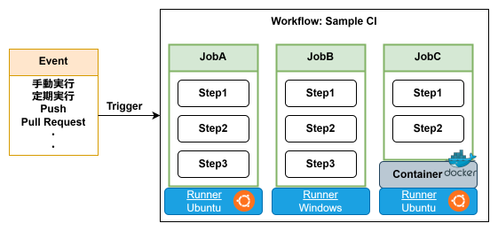
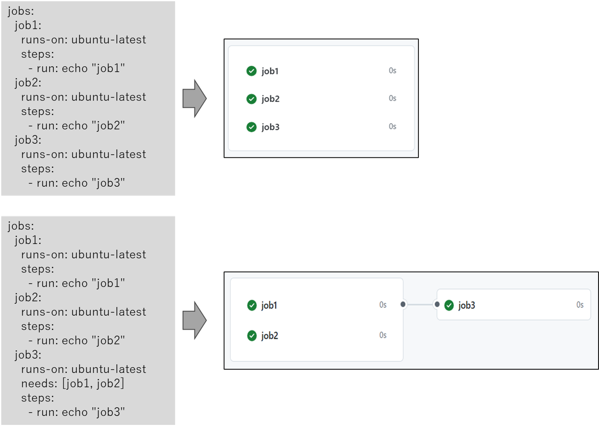
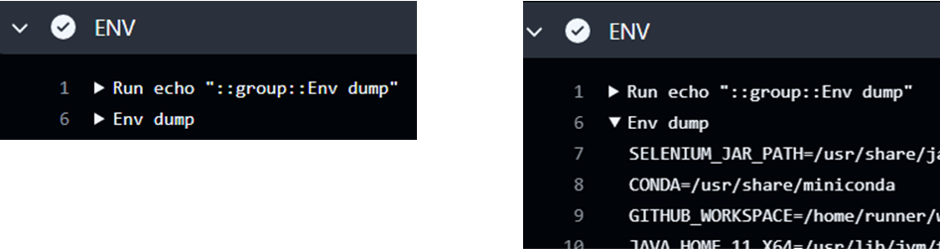
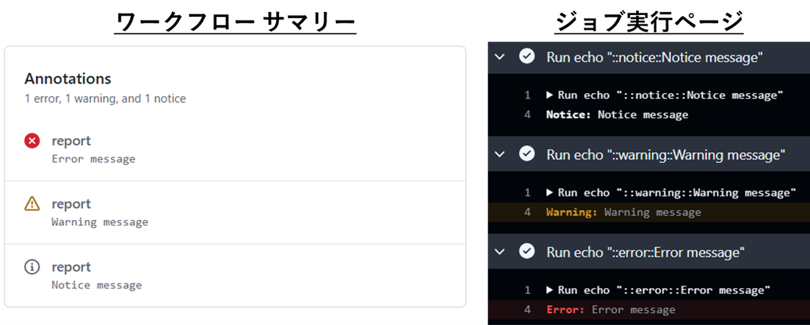

# GitHub Actions

## 1. Try to build CI/CD with GitHub Actions

昨今のソフトウェア開発では、開発から本番環境へのデリバリーまでのサイクルを加速し、試行錯誤や価値提供のスピードをあげることが求められている。CI/CDは、継続的なソフトウェア検証とデリバリーを通じて、この課題を解決する手法として注目されている。

Continuous Integration (CI) では、ビルドとテストを自動化して、ソフトウェア検証を継続的に行うことで、問題の早期発見を実現する。Continuous Delivery (CD) ではリリースとデプロイを自動化して、ヒューマンエラーを防止するとともに、リリース時の工数を低減する。これらの自動化により、ソフトウェア品質を保ちながら、安定して高頻度にリリースすることが可能となる。

GitHubでは、GitHub Actionsと呼ばれるCI/CDサービスが提供されており。GitHubのプラットフォーム緊密に統合されているのが特徴である。これにより、GitHubで管理するコードやイベント(Push, Pull Request, Release)と直接連携しながら、ワークフローの定義から実行、結果の確認までを一元的に管理できる。本稿ではこのGitHub Actionsについて解説する。

### ワークフローを定義する

Github Actionsでは、ワークフローという単位で処理を定義する。ワークフローはコードのビルド、テスト、デプロイなどの一連の処理を自動化する仕組みである。YAMLファイルで記述し、リポジトリの`.github/workflows`に配置することで、Github Actionsで実行可能となる。

また、ワークフロー内で実行する最小の処理単位をアクションと呼ぶ。再利用可能な形で実装されており、公開されたアクションを利用することもでき、独自に作成したアクションをリポジトリ内に配置して使用することもできる。

例えば、リポジトリ内では、以下のような構成でファイルを配置する：

```
REPO_ROOT
  └── .github
        ├── workflows
        |   ├──  ...
        |   └──  ワークフローファイル
        |
        ├── actions
        |   ├──  ...
        |   └──  独自に作成したアクション
        |
        └── scripts
            ├──  ...
            └──  その他のツール、スクリプト
```

以下は、ワークフローのサンプルコードである。これを`.github/workflows/hello.yml`として動作確認のため保存する。

```yaml
name: Sample CI

on:
  push:
    branches: [ "main" ]
  workflow_dispatch:

jobs:
  hello:
    runs-on: ubuntu-latest

    steps:
      - uses: actions/checkout@v4

      - name: Hello step
        run: echo "Hello, GitHub Actions!"
```


### ワークフローを実行する ([参考ページ](https://docs.github.com/ja/actions/managing-workflow-runs-and-deployments/managing-workflow-runs/manually-running-a-workflow#running-a-workflow))

1. ワークフローを配置したリポジトリのGitHubページに移動する
2. リポジトリ名の下にある「Actions」をクリックする
3. 左側のサイドバーで、実行するワークフローを選択する
4. 「Run workflow」ボタンをクリックする

### 実行結果を確認する

ワークフローを実行すると、実行一覧に結果が追加される。
例えば、以下の情報を確認できる：

- ワークフロー全体の成功/失敗状態
- 各ジョブやステップの実行状況
- 実行ログ
- 実行時間
- 生成された成果物

## 2. Workflow Components

ワークフローファイルは以下で構成される：

* ワークフロー： 1つのYAMLファイルで定義され、指定されたイベントをトリガーにジョブを実行する
* イベント：ワークフローのトリガー
* ジョブ：ワークフローの実行単位、jobs以下に複数定義可能
* ランナー：ジョブの実行環境
* ステップ：ワークフローにおける処理の最小単位、steps以下に複数定義可能



前述のワークフローファイルで説明すると、以下の通りである：

```yaml
name: Sample CI  # ワークフローの名前。Github Actions上に表示される。

on:　# イベント
  push:              # 発火条件1：main branchに変更がpushされたとき
    branches: [ "main" ]
  workflow_dispatch: # 発火条件2：手動実行されたとき

jobs:
  hello:  # ジョブ1： ジョブ名は"hello"
    runs-on: ubuntu-latest  # ランナー: ジョブ1はubuntu上で実行

    steps:
      - uses: actions/checkout@v4  # ステップ1: ソースコードをチェックアウト 
      - name: Hello step           # ステップ2: 文字列を出力、ステップ名は "Hello step"
        run: echo "Hello, GitHub Actions!"
```

### イベント

主要なイベントとして、「手動実行」「定期実行」「Push/Pullrequestイベント」について解説する。
それ以外のイベントについては[イベント一覧](https://docs.github.com/ja/actions/writing-workflows/choosing-when-your-workflow-runs/events-that-trigger-workflows)を参照のこと。

<br>

#### <ins>手動実行: workflow_dispatch</ins>

リポジトリのページからワークフローを手動実行するためのイベントである。
入力パラメータは `inputs` キーで指定し、ワークフロー内で `${{ inputs.xxx }}` の形式で参照する。

```yaml
name: Manual Run
on:
  workflow_dispatch:
    inputs:
      message:
        required: true
      log-level:
        type: choice
        default: 'warning'
        options:
          - info
          - warning
          - debug
      environment:
        description: 'Environment to run tests'
        type: environment

jobs:
  build:
    runs-on: ubuntu-latest
    steps:
      - run: echo "${{ inputs.message }}, Log level ${{ inputs.log-level }}"
```

入力パラメータには使用可能なプロパティは以下の通りである：

* type: データ型（boolean, number, string, choice, environment）
  * choice: 選択式入力、選択肢はoptionsで指定
  * [environment](https://zenn.dev/kitoketa/articles/f98a082e233c29): 登録済みの`Environments`から選択、`Environments`については[後述](#Environments)

* default: デフォルト入力値
* required: 指定が必須かどうか
* description: パラメータの説明文

<br>

#### <ins>定期実行: schedule</ins>

定期的にワークフローを実行するためのイベントである。実行タイミングはcron式で指定する。

```yaml
on:
  schedule:
    - cron: '30 0,12 * * 1'  # Run 0:30 and 12:30 on every Monday
    - cron: '30 6,18 * * 3'  # Run 6:30 and 18:30 on every Wednesday
```

<br>

#### <ins>Push / Pullrequestイベント</ins>

コード変更のイベントが生じたときにワークフローを実行する。
`push`はリポジトリへのプッシュ、`pull_request`はプルリクエストの作成や更新時に発火する。

```yaml
on:
  push:
    branches: [ main ]  # When code is pushed into the main branch 
  pull_request:
    branches: [ main ]  # When PR is created/updated for the main branch
```

### ランナー

* [GitHub-hosted Runner](https://docs.github.com/ja/actions/using-github-hosted-runners/using-github-hosted-runners/about-github-hosted-runners)：
  GitHubの提供するマネージドな実行環境。特別な要件がなければ、こちらの利用を推奨する。
* [Self-hosted Runner](https://docs.github.com/ja/actions/hosting-your-own-runners/managing-self-hosted-runners/about-self-hosted-runners)：
  利用者が独自に用意・運用する実行環境。自身で用意するのでOSやスペックなどを自由に決められる。
* Container Runner:
  Docker containerをRunnerとして使用する。

```yaml
jobs:
  container-job:
    runs-on: self-hosted  # Containerをデプロイするホスト
    container:
      image: ubuntu:22.04
      volumes:
        - .....
      options: --cpus 1
    steps:
      .....
```

### ステップ

* 「シェルコマンド」による定義：
  `run`キーで指定し、通常のシェルスクリプトのように記述する。
  (例)
  
  ```yaml
  - run : |
      echo "test"
      ls -l
  ```
  
* 「アクション」による定義：
  `uses`キーでアクション名を指定し、`with`キーで引数を指定する。
  (例)
  
  ```yaml
  - uses: actions/checkout@v4
    with: ref
      ref: main
  ```

## 3. Workflow Syntax

### 式と関数

* リテラル
  * null
  * boolean: `true` / `false`
  * number: 数字
  * string: 文字列
* 演算子
  * `!`, `&&`,`||`
  * `==`,`!=`,`>=`,`<=`,`>`,`<`
  * `()`,`[]`,`.`
* 関数
  * 文字列比較：contains(`VAR`, `keyword`), startsWith(`VAR`, `keyword`), endsWith(`VAR`, `keyword`)
  * 文字列生成：format(),join()
  * JSON操作：toJSON(`VAR`),fromJSON(`VAR`)
  * ハッシュ生成：hashFiles()
* フィルタ ( e.g. `${{ github.event.*.html_ur l}}` )
  * ```*```: 任意の文字列にマッチ（スラッシュを除く）
  * ```**```:任意の文字列にマッチ（スラッシュを含む）
  * `?`: 0文字または1文字（例：`test?.txt` → `test.txt`, `test1.txt`）
  * `+`: 任意の1文字（例：`test+.txt` → `test1.txt`）
  * `[]`: 括弧内の任意の1文字（例：`test[A-Z].txt` → `testX.txt`）
  * `!`: マッチしたパターンを除外（例：`!Readme.md`）

### コンテクスト

コンテキストは、ワークフローの実行、変数、ランナーの環境、ジョブ、ステップなどの情報へのアクセスを提供する。
各コンテキストはプロパティを含むオブジェクトであり、`${{  github.actor }}`の形式で参照する。

例えば、以下のようなコンテクストが存在する：

* githubコンテクスト：ワークフローの情報やイベントの情報を提供する ([プロパティ一覧はこちら](https://docs.github.com/ja/actions/writing-workflows/choosing-what-your-workflow-does/accessing-contextual-information-about-workflow-runs#github-context))

  * github.actor: ワークフローの実行ユーザ

  * github.run_id: 実行ID

  * github.event: トリガーとなったイベント

  * github.repository: リポジトリ名

  * github.head_ref: プルリクエストのソースブランチ


* runnerコンテクスト：実行環境の情報を提供する ([プロパティ一覧はこちら](https://docs.github.com/ja/actions/writing-workflows/choosing-what-your-workflow-does/accessing-contextual-information-about-workflow-runs#runner-context))

  * runner.name: ランナーの名前

  * runner.os: ランナーのOS


また、デバッグの手助けとして、以下のように書き、設定されたコンテクストを確認することができる：

```yaml
steps:
  - name: 'Debug github context'
    run: echo '${{ toJSON(github) }}'
  - name: 'Debug runner context'
    run: echo '${{ toJSON(runner) }}'
```

### 環境変数

環境変数は`env`キーを使用して設定する。ワークフロー全体から個別のステップまで、必要なスコープに適用することができる。
環境変数の参照は、`${MY_ENV_VAR}}`、もしくは、コンテキストを介して`${{ env.MY_ENV_VAR }}`と記述する。なお、GitHub Actionsが提供するデフォルトの環境変数については[公式ドキュメント](https://docs.github.com/ja/actions/writing-workflows/choosing-what-your-workflow-does/store-information-in-variables#default-environment-variables)を参照のこと。

また、セキュリティ上の理由から、コンテキストの値を直接参照するのは避けて、環境変数を経由してアクセスすることが推奨されている（中間環境変数）。

```yaml
on:
  workflow_dispatch:
  
env:
  # ここに書くと、ワークフロー内全域に指定した環境変数を適用
    
jobs:
  job:
    steps:
      - run: echo "This is test"
        env:
          # ここに書くと、このステップにだけ指定した環境変数を適用

      - run: echo "The actor is ${{ github.actor }}."  # インジェクションのリスクあり
      - run: echo "The actor is ${ACTOR}"              # インジェクションを回避〇
        env:
          ACTOR: ${{ github.actor}}
```

### Variables / Secrets

GitHub Actionsでは、複数のワークフローで共通して使用する値を`Variables`と`Secrets`として事前に登録できる。値の参照はコンテクストを介して取得し,`${{ var.VAR_NAME }}` や `${{ secrets.PASSWORD }}` のように記述する。

Varibles/Secretsは以下のように使い分ける：

- **Variables**：機密性が低い情報を格納。
- **Secrets**：機密性が高い情報を格納。Secretsに登録された情報は暗号化され、ログや設定画面でもマスクされる。

参考情報：

* [Variablesに情報を格納する](https://docs.github.com/ja/enterprise-cloud@latest/actions/writing-workflows/choosing-what-your-workflow-does/store-information-in-variables)
* [GitHub ActionsでのSecretsの使用](https://docs.github.com/ja/actions/security-for-github-actions/security-guides/using-secrets-in-github-actions)

### Environments

`Environments`は、複数のデプロイ環境（本番環境、テスト環境など）を管理するための機能である。以下のような特徴がある：

* デプロイ先ごとに異なる変数(ホスト名やユーザ名など)やシークレット（パスワードなど）を管理する
* ```Environment```をデプロイ先の数だけ作成し、```Environment variable```sと```Environment secrets```をそれぞれに登録する
* ジョブの中で使用するときには、```environment: <environment-name>```と指定する


### 条件分岐

`if`キーを使用することで、ジョブやステップの実行条件を制御できる。

<ins>ステータスによる条件分岐</ins>

* success(): 手前の処理が成功したらTrue
* failure(): 手前の処理が失敗したらTrue
* cancelled(): 手前の処理がキャンセルされたらTrue
* always(): 手前の処理の結果に関係なくTrue

(例)

```yaml
steps:
  - run: echo "This is test"
  - run: echo "Run if success"
    if: ${{ success() }}
```

<br>

<ins>条件式による条件分岐</ins>

(例)

```yaml
steps:
  - run: echo "This is run by manual run"
    if: ${{ github.event_name == 'workflow_dispatch' }}
  - run: echo "This is run by code push"
    if: ${{ github.event_name == 'push' }}
```


### ステップ間のデータ共有

* GITHUB_OUTPUT: 変数としてデータを保持
* GITHUB_ENV: 環境変数としてデータ保持
  ※基本はGITHUB_OUTPUTを推奨、環境変数としてセットが必要なときだけGITHUB_ENVを使用する

```yaml
steps:
  - run: export SHARE="test"
  - run: echo "${SHARE}"  # ステップごとに変数がリセットされるため、何も表示されない

  - id: my_step
    run: echo "share=test" >> ${GITHUB_OUTPUT}
  - run: echo "${{ steps.my_step.outputs.share }}" # id:my_stepの出力した変数share が表示される

  - run: echo "SHARE=test" >> ${GITHUB_ENV}
  - run: echo "${SHARE}"                           # 環境変数として取り出し
```


もしくは、以下のように書くこともできる：

```yaml
steps:
  - id: my_step
    run: echo "share=test" | tee -a ${GITHUB_OUTPUT}
  - run: echo "${{ steps.my_step.outputs.share }}"

  - run: echo "SHARE=test" | tee -a ${GITHUB_ENV}
  - run: echo "${SHARE}"
```


### その他のテクニック

**<ins>実行タイトルの設定</ins>**

`run-name`キーを使用して、実行タイトルを動的に設定できる。

```yaml
run-name: Run by @${{ github.actor }}
jobs:
  ....
```


**<ins>シェルの指定</ins>**

ステップごとに使用するシェルを指定できる。

```yaml
steps:
  - run: echo "This will be run w/ bash"
    shell: bash
```

例えば、bash, python, powershellなどが指定可能。
なお、shellキーの有無でBashの起動オプションが変わる点に注意：

* 省略時：```bash -e {0}```
* 記述時：```bash --noprofile --norc -eo pipefail {0}```

また、デフォルトシェルを指定するときは、以下のように指定する：
※ bashであっても、上記で説明したようにshell指定の有無で挙動が変わるので重要

```yaml
defaults:
  run:
    shell: bash  # これで、各ステップのデフォルトが bash --noprofile --norc -eo pipefail {0}となる
jobs:
  ....
```


**<ins>エラーハンドリング</ins>**

```continue-on-error```を指定すると、ステップがエラーになっても後続のステップを実行する。

```yaml
jobs:
  build:
    runs-on: ubuntu-latest
    steps:
      - run: exit 1
        continue-on-error: true
      - run: echo "This will be run even if above step is failed."
```


**<ins>タイムアウト設定</ins>**

```yaml
jobs:
  build:
    runs-on: ubuntu-latest
    timeout-minutes: 1  # Timeout: 1min
```


## 4. Designing Workflow

### 複数ジョブの制御

* デフォルトでは、それぞれのジョブは並列実行される
* ジョブ間に依存関係があり逐次実行する場合、`needs`キーを使用して実行順序を制御する



### ジョブ間のデータ共有

* ジョブ間でデータを共有する場合、`outputs`を使用する
* 値の設定：`${GITHUB_OUTPUTS}`に値を出力し、`outputs`にて格納する変数を指定する
* 値の参照：`${{ needs.ジョブ名.outputs.変数名 }}`の形式でアクセスする

```yaml
jobs:
  build:
    runs-on: ubuntu-latest
    steps:
      - id: build_action
        run: echo "share=success" >> ${GITHUB_OUTPUT}
    outputs:
      result: ${{ steps.build_action.outputs.share }}

  report:
    runs-on: ubuntu-latest
    needs: [ build ]
    steps:
      - run: echo "${{ needs.build.outputs.result }}"
```


### Matrix

`strategy.matrix`は、複数の設定でジョブを実行する機能である。これを使用して、複数のOSや複数バージョンのアプリ、実行環境の組み合わせを一度にテストすることができる。

以下の例では、`os`と`python version`を指定しており、合計4パターンのジョブが実行される。

```yaml
jobs:
  build:
    strategy:
      matrix:
        os: [ubuntu-latest, windows-latest]
        python-version: [2.7, 3.8]
    runs-on: ${{ matrix.os }}
    steps:
      - run: echo "${{ matrix.os }}-${{ matrix.python-version }}"
```


また、特定の組み合わせのジョブを実行する場合には、`includes`を使用する。
以下の例では、 `ubuntu x python2.7`と`windows x python3.8`のみ実行される。

```yaml
jobs:
  build:
    strategy:
      matrix:
        include:
          - os: ubuntu-latest
            python-version: 2.7
          - os: windows-latest
            python-version: 3.8
    runs-on: ${{ matrix.os }}
    steps:
      - run: echo "${{ matrix.os }}-${{ matrix.python-version }}"
```


### キャッシュ

```actoins/cache```は、ダウンロードや生成物などの再利用可能なデータをキャッシュする機能である。キャッシュを使用することで、ビルド時間を短縮し、ワークフローの実行効率を向上させることができる。

(例)

```yaml
- uses: actions/cache@v4
  with:
    path: ${{ github.workspace }}/cache
    key: key-${{ runner.os }}-${{ github.sha }}
    restore-keys: key-${{ runner.os }}
```


<ins>キャッシュの動作</ins>

* `path`で指定したファイルやディレクトリがキャッシュの対象となる
* `key`に完全一致したら、そのキャッシュが指定パスに展開される
* 一致するキャッシュがない場合で、`restore-keys`に前方一致するキャッシュが存在すればそれが展開される
* `actions/cache`では保存と復元を両方担当するが、以下のサブアクションにて片方だけ実行も可能である：
  * `action/cache/save`: キャッシュの保存だけ
  * `action/cache/restore`: キャッシュの復元だけ


<ins>キャッシュの削除</ins>

* 7日以上アクセスされていないキャッシュは自動的に削除される
* 合計サイズは各リポジトリ10GBまで
* リポジトリの「Actions」ページからキャッシュの確認と削除ができる

<ins>サンプルコード</ins>

```yaml
env:
  CACHE_PATH: ${{ github.workspace }}/cache
steps:
  - name: Cache test file
  　id: cache-file
    uses: actions/cache@v4
    with:
      path: ${{ env.CACHE_PATH }}
      key: key-${{ runner.os }}-${{ github.sha }}
      restore-keys: key-${{ runner.os }}

  - name: Create test file
    if: steps.cache-file.outputs.cache-hit != 'true'
    run: |
      mkdir -p ${CACHE_PATH}
      echo "This is a test file" > ${CACHE_PATH}/test.txt

  - name: Read cache
    run: cat ${CACHE_PATH}/test.txt
```


### アーティファクト

Artifactは、ジョブ間でファイルを共有するための機能である。`actions/upload-artifact`でアップロードを行い、`actions/download-artifact`でダウンロードを行う。また、実行完了後も一定期間保存され、ワークフローの実行ページから生成物の確認、ダウンロード、削除ができる。

```yaml
- uses: actions/upload-artifact@v4
  with:
    name: キーワード
    path: アップロードするファイルやディレクトリのパス
    retention-days: 保存期間
```

```yaml
- uses: actions/download-artifact@v4
  with:
    name: キーワード
    path: ダウンロードするファイルやディレクトリのパス
```


<ins>サンプルコード</ins>

```yaml
steps:
  - run: echo "This is test" > test.txt
  - uses: actions/upload-artifact@v4
    with:
      name: keyword
      path: test.txt
      retention-days: 1
  - uses: actions/download-artifact@v4
    with:
      name: keyword
      path: download
  - run: cat download/test.txt
```


### レポーティング

**<ins>デバッグログの有効化</ins>**

* ワークフローの再実行時に「Enable debug logging」にチェックをつける

* SecretsまたはVariableへ特定のキーと値をセットする：

  * ステップデバッグログ：`ACTIONS_STEP_DEBUG: True`

  * ランナー診断ログ：`ACTIONS_RUNNER_DEBUG: True`


**<ins>デバッグログの出力</ins>**

ワークフローコマンド `::debug::`を使用して、デバッグログを出力できる。
```yaml
run: echo "::debug::This is debug message."
```


**<ins>ログのグループ化</ins>**

ワークフローコマンド`::group::<group-name>`と`::endgroup::`を使用してログ出力をグループ化できる。囲まれた部分の出力はグループ化されて、折りたたまれて表示される。

グループ化は、環境変数や実行環境の情報など、デバッグにそなえて多くの出力をするときに有効である。例えば、以下では環境変数の一覧を折りたたんで表示しており、必要なときだけ展開して確認することができる。

```yaml
steps:
  - name: ENV
    run: |
      echo "::group::Env dump"
      printenv
      echo "::endgroup"
```



**<ins>アノテーション</ins>**

ワークフローコマンド`::notice::`, `::warning::`, `::error::`を使用して、重要度に応じたメッセージを出力できる。また、ワークフローの実行ページのサマリー部分にも表示され、重要なメッセージを強調して残すことができる。

```yaml
steps:
  - run: echo "::notice::Notice message"
  - run: echo "::warning::Warning message"
  - run: echo "::error::Error message"
```



**<ins>ジョブサマリー</ins>**

`${GITHUB_STEP_SUMMARY}` へマークダウン形式を出力すると、整形されて、ワークフロー実行ページ上にサマリー表示が生成される。ジョブの実行結果の要約やテスト結果の可視化の方法として有用である。

```yaml
steps:
  - run: |
      echo "## Sameple job summary" >> ${GITHUB_STEP_SUMMARY}
      echo " * First item" >> ${GITHUB_STEP_SUMMARY}
      echo " * Second item" >> ${GITHUB_STEP_SUMMARY}
```


**<ins>チャット通知</ins>**

(Slackへの通知例)
```yaml
- uses: slackapi/slack-github-action@v1
  with:
    channel-id: 'CHANNEL_ID'    # 通知先チャンネルのID
    slack-message: |
      ${{ github.repository }} の実行結果:
      状態: ${{ job.status }}
      URL: ${{ github.server_url }}/${{ github.repository }}/actions/runs/${{ github.run_id }}
  env:
    SLACK_BOT_TOKEN: ${{ secrets.SLACK_BOT_TOKEN }}
```


(Teamsへの通知例)

```yaml
- uses: jdcargile/ms-teams-notification@v1.3
  with:
    webhook_url: ${{ secrets.MS_TEAMS_WEBHOOK_URL }}
    github_token: ${{ secrets.GITHUB_TOKEN }}
    notification_summary: 'ワークフロー実行結果'
    notification_color: 'red'
    final_status: ${{ job.status }}
```


## 5. Action Module

アクションはモジュール化の重要な手段であり、複雑な処理を再利用可能なコンポーネントとして実装することができる。

アクションには、公開リポジトリで管理されているリモートアクションと、同一リポジトリ内で管理するローカルアクションが存在する。また、アクションの実装には以下の３つの方法が存在する：

* Composite Action：既存のアクションやシェルコマンドを組み合わせて実装
* JavaScript Action：Node.jsを使用して実装
* Docker Container Action：Dockerコンテナとして実装


### リモートアクション / ローカルアクション

リモートアクションは、`actions/checkout@v4`などを指す。文字列とURLは連動しており、`{owner}/{repository}@{tag}`で指定して使用する。例えば、`actions/checkout@v4`は`https://github.com/actions/checkout`のv4を指し、`docker/build-push-action@v5`は`https://github.com/docker/build-push-action`のv5を指す。

ローカルアクションは、アクションを格納したディレクトリのパスを指定して使用する。ファイルを`.github/actions`に配置して、以下のような構造で実装する：

```
ROOT_REPO
└── .github
　   └── actions
    　   ├── action-name-A/   # アクション名を表すディレクトリ
    　   │    ├── action.yml  # アクションの定義ファイル
    　   │    └── ...         # 必要に応じて、その他のファイル
    　   |   ....
    　   │
    　   └── action-name-Z/
    　       ├── action.yml
    　       └── ...
```


### Composite Action

Composite Actionはワークフローファイル同様に、複数のシェルやアクションを組み合わせて作成する。メタデータ構文と呼ばれる構文で書かれており、`input`、`output`、`runs`とその他のキーで構成される。なお、ワークフローファイルと異なり、shellの指定を省略できない点に注意が必要である。

以下に、サンプルコードを示す：
[.github/actions/sample/action.yml]

```yaml
name: Sample Action
description: |
  This is a sample action module.

inputs:  # アクションの入力
  message:
    description: Print text
outputs: # アクションの出力
  time:
    value: ${{ steps.get-date.outputs.time }}

runs:　# `using: composite`から始めて、手続きを記載
  using: composite
  steps:
    - id: get-date
      shell: bash
      run: |
        echo "Hello ${{ inputs.message }}."
        echo "time=$(date)" >> ${GITHUB_OUTPUT}
```

[ワークフロー]

```yaml
steps:
  - uses: actions/checkout@v4       # action.ymlを参照するため、checkoutは必須
  - id: sample
    uses: ./.github/actions/sample/ # 使用するアクションのサブディレクトリを指定
    with:
      message: Test                 # ここに入力引数を指定
  - run: echo "${{ steps.sample.outputs.time }}"  # 出力の受け取りはstep間のデータ共有と同様、idで参照
```


### Javascript Action

Javacript Actionでは、Node.jsを使用してアクションを実装する。入出力はJavscript libraryである`@actoins/core`を介して行う。
以下に、基本的なディレクトリ構成とサンプルコードを示す。

```
<基本形>
.github/actions/javascript-example/
  ├── action.yml    # アクションの定義ファイル
  ├── index.js      # メインのソースコード
  └── package.json  # 依存関係の定義
```

[action.yml]

```yaml
name: Sample Action
description: |
  This is a sample action module.

inputs:
  message:
    description: Print text
outputs:
  time:
    description: Current Time

runs:
  using: node20
  main: index.js
```

[index.js]

```javascript
const core = require('@actions/core');

try {
  const message = core.getInput('message');
  console.log(`Hello ${message}.`);
  const time = (new Date()).toTimeString();
  core.setOutput("time", time);
} catch (error) {
  core.setFailed(error.message);
}
```

[package.json]

```json
{
 "name": "sample-action",
 "version": "1.0.0",
 "description": "Sample Action",
 "main": "index.js",
 "dependencies": {
   "@actions/core": "^1.10.1"
 }
}
```

[ワークフロー]

```yaml
steps:
  - uses: actions/checkout@v4
  - uses: actions/setup-node@v4
  - run: npm install
    working-directory: ./.github/actions/sample
  - uses: ./.github/actions/sample/
    id: sample
    with:
      message: Test
  - run: echo "${{ steps.sample.outputs.time }}"
```


### Docker Container Action

Docker Container Actionでは、Dockerコンテナとしてアクションを実装する。特定のランタイムや環境、複雑な依存関係がある場合に適している。入力はシェルの実行引数を介して行い、出力は`${GITHUB_OUTPUT}`を介して行う。
以下に、基本的なディレクトリ構成とサンプルコードを示す。

```
.github/actions/docker-example/
  ├── action.yml
  ├── Dockerfile
  └── entrypoint.sh
```

[action.yml]

```yaml
name: Sample Action
description: |
  This is a sample action module.

inputs:
  message:
    description: Print text
outputs:
  time:
    description: Current Time

runs:
  using: docker
  image: Dockerfile
  args:
    - ${{ inputs.message }}
```

[Dockerfile]

```dockerfile
FROM alpine:3.19
COPY entrypoint.sh /entrypoint.sh
RUN chmod +x /entrypoint.sh
ENTRYPOINT ["/entrypoint.sh"]
```

[entrypoint.sh]

```bash
#!/bin/sh -l
echo "Message: $1"
echo "time=$(date)" >> ${GITHUB_OUTPUT}
```

[ワークフロー]

```yaml
steps:
  - uses: actions/checkout@v4
  - uses: ./.github/actions/sample/
    id: sample
    with:
      message: Test
  - run: echo "${{ steps.sample.outputs.time }}"
```


## 6. Workflow Collaboration

### ワークフローの排他制御と自動キャンセル

`concurrency`を使用することで、同時実行するワークフローの数を制御できる。同じ`concurrency`グループに属するワークフローは、一度に1つしか実行されない。
例えば、以下の設定では、同一のプルリクエストに連続で更新が行われた時に、ワークフローが並行で実行されることを防止する。

```yaml
name: Exclusive workflow
on: pull_request
concurrency:
  group: ${{ github.workflow }}-${{ github.ref }}  # 同じPull Requestからのワークフローの同時起動を防止する
jobs:
  ....
```


さらに、以下のように`cancel-in-progress: true`を設定することで、同じグループの古い実行を自動的にキャンセルできる。これは、最新のコミットに対する処理のみを実行したい場合に有用である。

```yaml
name: Auto Cancel
on: pull_request
concurrency:
  group: ${{ github.workflow }}-${{ github.ref }}
  cancel-in-progress: true
jobs:
  ....
```


### ワークフローの再利用（Reusable Workflows）

`workflow_call`を使用して、ワークフローを再利用可能なモジュール（Reusable Workflows）として定義し、他のワークフローから呼び出すことができる。アクションが１つの処理をカプセル化する一方で、Reusable Workflowsはワークフローを丸ごとカプセル化する。リリース時の検証とパッケージ生成といった複数のワークフローを再利用するようなケースにて効果を発揮する。

以下に、サンプルコードを示す。

[Reusable Workflow]

```yaml
name: Reusable Workflows
on:
  workflow_call:
    inputs:  # 入力パラメータの定義はworkflow_dispatchと同様
      message:
        type: string
    secrets: # マスクするパラメータにはsecretsを使用
      token:
        description: Token
    outputs: # 出力の定義
      result:
        value: ${{ jobs.build.outputs.result }}

jobs:
  build:
    runs-on: ubuntu-latest
    outputs:
      result: ${{ steps.step1.outputs.time }}
    steps:
      - id: step1
        run: |
          echo "Input is ${{ inputs.message }}, ${{ secrets.token }}."
          echo "time=$(date)" >> ${GITHUB_OUTPUT}
```

[呼び出し]

```yaml
name: Caller Workflow
　　....
jobs:
  call:
    uses: ./.github/workflows/reusable_workflow.yml
    with:
      message: "Hello"
    secrets:
      token: "12345"
  print:
    runs-on: ubuntu-latest
    needs: [ 'call' ]
    steps:
      - run: echo "${{ needs.call.outputs.result }}"
```


### ワークフローの外部実行

`repository_dispatch`イベントを使用し、APIを介して特定のイベントを発行し、ワークフローを実行することができる。`types`で受け付けるイベントタイプを指定し、`client_payload`で受け取ったデータにアクセスする。なお、他のイベントと異なり、このイベントはリポジトリのデフォルトブランチ（通常、`main`か`master`）でのみ動作する点に注意が必要である。

以下に、サンプルコードを示す。

```yaml
name: API Runnable Workflow
on:
  repository_dispatch:
    types: [build, deploy]

jobs:
  build:
    runs-on: ubuntu-latest
    steps:
      - name: Build Event
        if: github.event.action == 'build'
        run: echo "Build triggered with ${{ github.event.client_payload.version }}"
      - name: Deploy Event
        if: github.event.action == 'deploy'
        run: echo "Deploy triggered to ${{ github.event.client_payload.environment }}"
```


このイベントを使用して外部から実行するには、パーソナルアクセストークンを使用する方法と、GitHub Appsを使用する方法がある。以下は、それぞれの方法を使用した呼び出し方法である：

[パーソナルトークンを使用して実行する場合]

```bash
curl -X POST \
  -H "Authorization: token ${GITHUB_TOKEN}" \
  -H "Accept: application/vnd.github.v3+json" \
  https://api.github.com/repos/${OWNER}/${REPO}/dispatches \
  -d '{"event_type": "build", "client_payload": {"version": "v1.0.0"}}'
```

[GitHub Appsを経由して実行する場合]

```bash
curl -X POST \
  -H "Authorization: Bearer ${GITHUB_APP_TOKEN}" \
  -H "Accept: application/vnd.github.v3+json" \
  https://api.github.com/repos/${OWNER}/${REPO}/dispatches \
  -d '{"event_type": "build", "client_payload": {"version": "1.0.0"}}'
```


参考：トークンの取得方法

* パーソナルアクセストークン：[個人用アクセストークンを管理する](https://docs.github.com/ja/authentication/keeping-your-account-and-data-secure/managing-your-personal-access-tokens)
* GitHub Apps：[GitHub Appsの使用](https://docs.github.com/ja/apps/using-github-apps)

※セキュリティの観点から、オフィシャルな開発ではGitHub Appsの使用が推奨されている


## 7. Package Release

### リリースを開始するイベント

**<ins>タグイベント</ins>**

タグのプッシュをトリガーとして、ワークフローを開始する。

```yaml
on:
  push:
    tags:
      - 'v[0-9]+.[0-9]+.[0-9]+'  # e.g. v1.2.3
```


**<ins>リリースイベント</ins>**

GitHubのリリース機能と連携して、ワークフローを開始する。

```yaml
on:
  release:
    types: [ リリースイベントタイプ ]
```


リリース機能は以下の方法で作成できる。

1. GitHubのウェブページから

   * リポジトリの"Releases"セクションから作成

2. GitHub CLIから
   ```bash
   gh release create タグ \
     --title "タイトル" \
     --notes "ノート"
   ```

3. PyGithubを使用してpythonスクリプトから
   ```python
   from github import Github
   
   token = xxxx
   g = Github(token)
   repo = g.get_repo(repo_name)
   release = repo.create_git_release(
       tag=tag_name,
       name=release_name,
       message=body,
       draft=draft,            # (optional) default: False
       prerelease=prerelease,  # (optional) default: False
   )
   ```


リリースの作成時にオプションとして`draft`, `prerelease`を指定でき、これに対応するリリースイベントが発行される。

| draft / prerelease | リリースイベント    |
| ------------------ | ------------------- |
| False / False      | published, released |
| False / True       | preleased, released |
| True  / False      | created             |
| True  / True       | created             |


### リリースノートの自動生成

以下のサンプルコードは、タグをプッシュした時に、GitHub CLIを使用して前回のリリースからの変更をまとめたリリースノートを自動生成する。

```yaml
name: Create Release
on:
  push:
    tags:
      - 'v[0-9]+.[0-9]+.[0-9]+'  # e.g. v1.2.3

jobs:
  release:
    runs-on: ubuntu-latest
    env:
      VERSION: ${{ github.ref_name }}
    permissions:
      contents: write  # リリースノートの作成に必要なパーミッション
    steps:
      - uses: actions/checkout@v4
      - name: Build a Package
        run: |
          # ここにビルドに必要な作業を記述
          bazel build //...
          cd bazel-bin/
          tar zcvf ${RUNNER_TEMP}/myapp-${VERSION}.tar.gz myapp
      - name: Create Release Note
        run: |
          gh release create "${VERSION}" \
            --title "Release ${VERSION}" \
            --generate-notes

          gh release upload "${VERSION}" "${RUNNER_TEMP}/myapp-${VERSION}.tar.gz"
        env:
          GITHUB_TOKEN: ${{ secrets.GITHUB_TOKEN }}
```

1. タグのプッシュをトリガーにワークフローを実行
2. コードをビルドしてパッケージをtar.gz形式で生成
3. GitHub CLIを使用してリリースノートを自動生成
   ※`--generate-notes`オプション：
             前回リリースからのコミット履歴から、プルリクエストやコミットメッセージを含むリリースノートを自動生成
4. 指定したタグ名でリリースを作成


## GHA Best Practice

<ins>**プッシュ前にymlファイルを事前にチェックする**</ins>

以下のURLからダウンロードできるactionlintを使用して、構文チェックを行うことができる。
https://github.com/rhysd/actionlint/releases

```bash
$ actionlint .github/workflows/*.yml
```


**<ins>複数のイベントが登録されているときは、入力パラメータに注意する</ins>**

例えば、以下のようなワークフローを作成したとき、schedule/pull_requestではパラメータを指定できないが、workflow_dispatchはパラメータの設定が可能であるため、処理時に入力パラメータの有無に注意を払う必要がある。

* 定点確認のためにで１日１回コード検証を行う (`on: schedule`)
* プルリクエストでのレビューが開始されたらコード検証を行う（`on: pull_request`）
* デバッグ確認のため、手動実行も可能にしておく(`on: workflow_dispatch`)


対応策１：
 `github.event.inputs`をシェル処理で使用するのは避ける。最初のステップで、全パラメータを環境変数に設定して、それを代わりに使用する。

```yaml
jobs:
  build:
    runs-on: ubuntu-latest
    steps:
      - name: Prepare input parameters
        run: |
          BRANCH=${{ github.event.inputs.target_branch || "main" }
          SITE=${{ github.event.inputs.deploy_site || "develop" }}
          echo "BRANCH=${BRANCH}" >> ${GITHUB_ENV}
          echo "SITE=${SITE}" >> ${GITHUB_ENV}
        ....
```


対応策２：
`github.event.inputs`以下は常にnullとなりえる変数と仮定して、常に
`${{ github.event.inputs.xxx || "default value"}}`というようにデフォルト値を添える。


<ins>入力パラメータはジョブサマリーに表示する</ins>

GitHub Actionsの場合、入力パラメータの表示画面がない点に注意が必要である。そのため、例えば、入力パラメータは`${GITHUB_STEP_SUMMARY}`に出力し、ジョブサマリーに表示するなどデバッグや再実行を意識した実装が重要となる。


<ins>実行環境はロググループを使用して、情報を常に残す</ins>

ジョブが失敗したとき、エラー時の状況は非常に重要な情報である。そのため、`printenv`や`df`など実行環境に関する情報は実行ログに残しておくべきである。一方、大量の情報を残すと可視性が落ちる。そのため、`::group::` / `::endgroup::`を使用して、カテゴリ毎にグループ化して実行環境の情報を折りたたんで残すことが望ましい。
