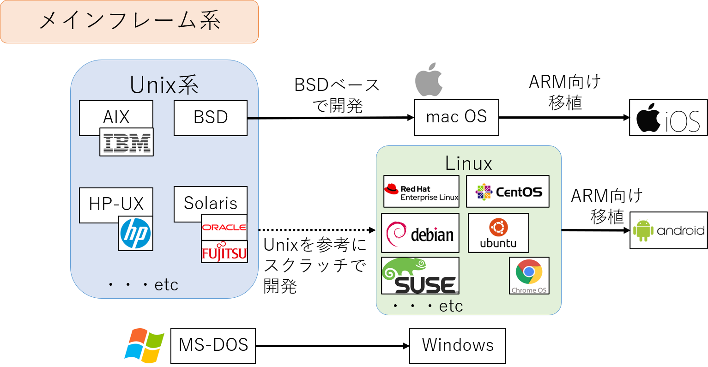

# Ubuntuのイロハ

## Linux / Ubuntuとは？

Microsoft WindowsやMacをはじめとして、様々なOSが普及している。LinuxもOSの1つであり、さらにその中に多くのディストリビューションが存在する。例えば以下のようなものがある。

- RedHat系 : RedHat Enterprise Linux（商用製品）, Fedora, CentOS
- Debian系：Debian, Ubuntu
- SUSE系: SUSE Enterprise Linux（商用製品）, OpenSUSE

UbuntuもLinuxディストリビューションの１つであり、19.10, 20.04, 20.10 ... と年２回の頻度でリリースされる。偶数年4月のリリースは長期間サポート版(Long Term Support, LTS)として扱われ、業務利用の場合、LTS版を採用することが一般的である。




OSの役割は、ハードウェア機能を抽象化し、ユーザアプリケーションへ提供することである。Linuxの場合は下図のように、中核部分のKernel、拡張機能のKernel module(デバイスドライバなど)、アプリケーションからKernel機能を呼び出す(=System Call)ためのインタフェースから構成される。


#### 関連コマンド

```bash
$ lsmod      # 組み込み済みのカーネルモジュールを一覧表示
$ modprobe   # カーネルモジュールを組み込む (依存関係も考慮してロード)
$ insmod     # 指定モジュールをロード (指定モジュール以外はロードしない)
$ rmmod      # 指定モジュールをアンロード
```


## Linuxが起動するまで

システムを立ち上げる処理をブートシーケンスと言う。Linuxでは以下のブートシーケンスにそってシステムが起動する。

0. 電源ON
1. BIOS/UEFIがハードウェアを初期化後、ディスクに格納されたブートローダを実行
2. ブートローダはカーネルとinitramfsを読み込み、メモリ上に展開
3. initramfsは必要なカーネルモジュールをロード、ルートファイルシステムをマウント
4. initfamfsはsystemdを実行し各種サービスを起動
   a. udevが接続デバイスの情報を読み込み、/dev以下にデバイスファイルを生成
   b. ブロックデバイスを/etc/fstabに従いマウント
   c. ネットワークの設定、ソケットの起動
   ...etc


## システム管理 (systemd)

Linuxでは、systemdにより各種システムサービスの管理を行う。Linux起動時、以下のフローでベースサービスを立ち上げ、それに紐づく各種サービスの起動を行う。


#### 関連コマンド

```bash
sudo systemctl start xxxx.service    (起動)
sudo systemctl stop xxxx.service     (停止)
sudo systemctl restart xxxx.service  (停止⇒起動)
sudo systemctl reload xxx.service    (設定の再読み込み)
sudo systemctl status xxx.service    (サービス状態の表示)
sudo systemctl enable xxx.service    (起動時の自動実行ON)
sudo systemctl disable xxx.service   (  //         OFF)
sudo systemctl daemon-reload         (Unitファイル変更後の内容反映)
```

#### ファイル構成

```
/lib/systemd/system/xxxx.service   (パッケージが提供する設定ファイル)
/etc/systemd/system/xxxx.service   (管理者が設定を上書きするための設定ファイル)
```

#### Unit定義ファイル

**[Unit] 一般設定**

- Description: ユニットの説明、systemctl status実行時に表示される
- Documentaion: Document URI
- After/Befor: このユニットの後/前に起動するユニット
- Requires: このユニットが依存するユニット、前のユニット起動の成功時のみ起動
- Wants: このユニットが依存するユニット、前のユニット起動の成否にかかわらず起動
- Conflicts: 指定ユニットと同時に起動しない

**[Service]　サービス本体の定義**

- Type: 起動方法
  - simple: プロセスが起動したら完了
  - forking: forkして親プロセスが終了したら完了
  - oneshot: 次のユニットへ移る前に自身のプロセスを停止
  - dbus: D-Busを使用、D-Busの接続名を見つけたら完了
  - notify: sd_notify()関数で起動完了メッセージを受け取ると完了
  - idle: 他のジョブが終了するまで待機(シェルの出力が混ざるのを避けるため)
- ExecStart/ExecStop/ExecReload: start/stop/reload時に実行するコマンド
- Restart: プロセス停止時の再起動条件 
        always: 常に, no: 再起動しない, 
        on-success: 終了コードが0なら, on-failure: 終了コードが0以外なら

**[Install]    インストール時(systemctl enable時)の設定**

- RequiredBy: enable時に指定したユニットの.required以下にリンクを作成
- WantedBy: enable時に指定したユニットの.wantsディレクトリにリンクを作成


 Unitファイルの例:

```bash
[Unit]
Description=A sample software  # サービスの説明
After=multi-user.target
Before=graphical.target    # GUI起動前、マルチユーザモード起動後に起動させる

[Service]
Type=oneshot
ExecStart=/usr/bin/xx

[Install]
WantedBy=multi-user.target   # enable後、multi-user.targetに連動させて自動起動
```

#### その他のtarget

- shutdown.target: shutdown実行時に起動

- reboot.target: 再起動実行時に起動

- (おまけ) poweroff.target, halt.target

  

## デバイス管理(sysfs, udev)

Linuxでは、全てのデバイスを統一的に扱うため、接続デバイスを全てファイルとして扱う。アプリケーションからはKernelの内部情報にアクセスできないため、```sysfs``` という仕組みを使用して```/sys``` 以下にKernelが認識しているデバイス情報を投影する。次に、udevが定義ルールにそって動的に```/dev```などの下にデバイスファイルを作成する。


#### ファイル構成

```
/lib/udev/rules.d/NN-xxxx.rules   (パッケージが提供するudevルール)
/etc/udev/rules.d/NN-xxxx.rules   (管理者が作成するudevルール)
※NN: 起動順番(小さいほど先)、xxx: 任意の文字列
```

補足：自作ルールの場合、/etc/udev/rule.d/70-persistent-xx.rulesという名前が多い(e.g. 70-persistent-disk, 70-persitent-net, ...)

#### Ruleファイル

起動条件

- ACTION: イベント名(e.g. add, remove, change)
- KERNEL: kernel内部のデバイス名
- SUBSYSTEM: デバイスのサブシステム
- ATTR{filename}: デバイスのsysfs属性(ベンダー名など)

操作内容

- NAME: 作成するデバイスファイル名
- SYMLINK: 作成するシンボリックリンク名
- OWNER, GROUP, MODE: 作成デバイスのowner, group, permissioin設定

Special Character

- %r, $root: デフォルトのデバイスディレクトリ(/dev)
- %p, $devpath: DEVPATHの値
- %k, $kernel: KERNELの値 or 内部デバイス名
- %n, $number: デバイス番号
- %M, $major: デバイスのメジャー番号
- %m, $minor: デバイスのマイナー番号
- %s{attribute}, $attr{attribute}: sysfsの属性値
- %%: %文字
- $$: $文字


ruleファイルの例:

```
KERNEL=="sd*", ENV{DEVTYPE}=="disk", SYMLINK+="disk/by-id/$env{ID_BUS}-$env{ID_SERIAL}"
　⇒sdxx のデバイスかつディスクをつないだら /dev/disk/by-id/xx-xx というリンクを作成

SUBSYSTEM="block", KERNEL=="sd*", RUN="/usr/bin/logger %k"
 ⇒sdxx のブロックデバイスをつないだらデバイス名をログ出力
```


#### ブロックデバイス

- ディスクデバイスのこと

- 表現：/dev/sda, /dev/disk/by-id, /dev/disk/by-uuid, /dev/disk/by-path 　など同じデバイスを複数の形式で表現

- 通常は、１つのディスクを複数のパーティションに分割し、別々の領域として利用
   　/dev/sda ⇒  /dev/sda1, /dev/sda2, ... 

- 関連コマンド：

   ```
   空き容量を表示
   $ df
   Filesystem     1K-blocks   Used     Available Use% Mounted on
   /dev/sda1        106858       4461   102398     5% /boot/efi
   /dev/sda2        9983232   1727756  8239092    18% /
   ```

   ```
   ブロックデバイスを一覧表示
   $ lsblk
   NAME    MAJ:MIN RM   SIZE RO TYPE MOUNTPOINT
   sda       8:0    0    10G  0 disk 
   ├─sda1    8:1    0   106M  0 part /boot/efi
   └─sda2    8:2    0   9.9G  0 part /
   ```

   ```
   $ blkid DEVICE                     # 指定デバイスのブロックIDを表示
   $ dd if=DEVICE of=DEVICE/FILEPATH  # ifで指定したデバイスをブロックレベルで読み込み、ofで指定した場所へ出力(※)
   　(※) 要ルート権限のため、通常はsudoをつけて実行
   ```

   

#### ネットワークインタフェースデバイス

- ネットワークカード（のポート部分）のこと
- 表現：/sys/class/net/eno1, /sys/class/net/enp1 など
  - en: イーサネット、 wl: ワイヤレスLAN、ww: ワイヤレスWAN
  - o: オンボード、s: PCI Express、(無文字): 該当なし
  - p1, p2, .. : port1, port2, ...


#### 関連コマンド

```
$ lspci    # PCIデバイスを一覧表示
$ lscpu    # CPUの情報を表示
```


## Filesystem

ブロックデバイス内のデータをファイルとして管理するシステムをファイルシステム(FS)と呼ぶ。パーティション毎にファイルシステムを設定することができ、VFSという仕組みでファイルシステムに対する操作が抽象化されている。

ファイルシステムはツリー構造でデータを管理し、ルートFS("/")のツリーの下に他のFSを"mount"することで、１つのツリー上に全FSを連結する。(前述のsys fsも、カーネル内部のデバイスをファイルとして表現した、仮想ファイルシステムである)


OS起動時には、/etc/fstabの設定に基づき各ファイルシステムがマウントされる
/etc/fstab:

```
UUID=xxxx   /         ext4   defaults    0 1   # UUID=xxxxのディスクを '/' へext4 mount
UUID=yyyy   /boot/efi vfat   umask=0077  0 1   # UUID=yyyyのディスクを '/boot/efi' へvfat mount
LABEL=aa    /mnt      ext4   defaults    0 1   # LABEL=aaのディスクを '/mnt' へext4 mount
/swapfile   none      swap   sw          0 0   # /swapfileというファイルをスワップとして使用
```


関連コマンド

```bash
$ mount                       # マウント状態を一覧表示
$ sudo mount DEVICE DIR_PATH  # 指定ブロックデバイス(要フォーマット)を指定パスへマウント
$ sudo mount -t cifs //IP/PATH DIR_PATH  # 指定サーバの共有フォルダを指定パスへcifsマウント
```


関連ワード

- ext4: Linux向けファイルシステム
- NTFS: Windows向けファイルシステム
- CIFS/SMB/Samba: ファイル共有プロトコル、windows file serverはこれでアクセス
- NFS: ファイル共有プロトコル、CIFSと比べシンプル


## Network

Ubuntu16.04以降、ネットワークの設定はNetworkManagerと呼ばれるサービスで管理されている。
ネットワークの設定項目は多岐にわたるが、代表的な項目を以下に示す。

- IP address

  ネットワークの住所、IPv4(32bit)とIPv6(128bit)の２種類が存在する。
  組織内向けのPrivate IP address(10.x.x.x, 172.16.x.x, 192.168.x.x)と外部向けのGlobal IP addressが存在する。
  
- Default gateway / Default Route
  異なるネットワーク同士を接続するネットワーク機器。外部NWへの通信では、Default Gatewayとして設定したIPアドレス宛にパケットを送信。ネットワークインタフェース毎に設定可能で、複数のネットワーク接続時に未定義ネットワーク宛ての通信時にはDefault Routeとして設定したGatewayが使用される。
  
  

- DNS (Domain Name System)
  名前解決サーバ。文字列で宛先が指定されたときは、DNSに問い合わせてIPアドレスに置換してからパケットを送信する。(厳密には  DNSへの問い合わせ結果＋/etc/hostsの設定　からDomain NameをIPアドレスに置換)
  
- Proxy Server
  内部ネットワークにいるクライアントの代理として、外部ネットワーク接続しデータを送受信するサーバ。

    

- DHCP (Dynamic Host Configuration Protocol)
  IPアドレスを自動設定するための仕組み、DHCP: ONとしておけば、IPアドレスを指定しなくても（他機器と重複しない）IPアドレスを自動設定してくれ、DNSやDefault Routeも設定してくれる（DHCP serverの設定次第で）

#### 関連コマンド

```bash
$ ifconfig　　　    # ネットワーク情報の表示
$ ip               # ネットワーク情報の表示
$ ping IP_ADDRESS  # 指定IPへの導通確認（受ける側にICMP受信設定必要)
```

```bash
ルーティングテーブルの表示
$ route -n
Destination     Gateway         Genmask         Flags Metric Ref    Use Iface
0.0.0.0         192.168.1.1     0.0.0.0         UG    100    0        0 ens4      # Default Route
192.168.1.0     0.0.0.0         255.255.255.0   U     100    0        0 ens4      # 192.xx系はこっち
10.0.0.0        10.0.0.1        255.255.255.0   U     100    0        0 eno1      # 10.xx系はこっち     
```


## Application

#### Process / Thread

何らかのアプリケーションプログラムを実行すると、１つ以上のProcessが起動する。Processは1つ以上のThreadを生成し、スケジューラを介して各CPU coreへ割り当てて、アプリケーションの操作を実現する。また、Processはfork()により別のプロセス(子プロセス)を生成し、独立した処理を子プロセスに任せることができる。


#### Applicatioのコンパイルと実行 (C言語)

C言語のソースコードをコンパイルして実行ファイルを生成するとき、以下の種類のファイルが存在する。

- ヘッダファイル (.h) : 宣言だけを書いたファイル
- ソースファイル (.c)  : ヘッダファイルの各宣言の処理の中身を書いたファイル
- 静的ライブラリ (.a) : 複数のヘッダ/ソースファイルから生成したオブジェクト(.o)をまとめたもの<br>
  　　　　　　　　　  ライブラリとして使用するときに実行ファイルのコンパイル時に静的リンクする
- 共有ライブラリ(.so) : コンパイル時にはリンクされず、実行ファイルを実行するときに<br>
  　　　　　　　　　  動的にリンクされる。プラグインなど実行時に選択が生じる場合に便利


生成した実行ファイルをシェルにて実行する場合、以下のいずれかの方法で実行する(前者はパッケージでインストールしたコマンド、後者は手元作ったアプリの実行で利用することが多い）

1. 環境変数 $PATH 以下に実行パスを格納　⇒　実行ファイル名での実行が可能
2. 絶対パスを指定して実行ファイルを実行  
   

また、共有ライブラリを必要とする実行ファイルの場合には、以下のいずれかの方法で実行時リンクが必要である

1.  /etc/ld.conf, /etc/ld.conf.d/xxx.conf で指定したパスの中に共有ライブラリを格納
2. 環境変数  $LD_LIBRARY_PATH に指定したパスに共有ライブラリを格納
3. コンパイル時に -rpath で共有ライブラリの場所を指定


#### Signal

実行中のプロセスと通信するときは、Signalという仕組みを利用する。
プロセスはシグナルを受信すると、事前に定義したシグナルハンドラを呼び出し処理を行うため、プロセスへの介入が可能である。
有名なシグナルとして以下がある：

- SIGINT (2)  : キーボードによる割り込みシグナル (CTRL+C)
- SIGQUIT (3) : キーボードによる中止シグナル (CTLR+\\)
- SIGKILL (9) : 強制終了（シグナルハンドラでの対応不可能）
- SIGTERM (15) : 終了シグナル


#### 関連コマンド

```bash
$ ps aux   # 実行中プロセスとその情報を一覧表示、通常　ps aux | grep xxx という形でフィルタして表示
$ sudo kill PID  # 指定したPIDをもつプロセスをkill (デフォルト15番、 kill -9 xx とするとSIGKILLが飛ぶ)
```


## X window system (X11)

X window system とは、Unix/Linuxで標準的に使用されるウィンドウシステムのことである。X.orgというアプリケーションがよく使用される。キーボードやマウスなどの入力デバイスやモニターなどの出力デバイスと、Unix/Linux内で動作するアプリケーションとの間を仲介して、ユーザへGUI機能を提供する。クライアント・サーバモデルで実装されており、ネットワーク越しにGUIアプリケーションを起動することも可能である。


#### 関連ワード

- Display Manager (xdm, lightdm, gdm, kdm, ..) :
  ログイン時にX serverを起動し、ウィンドウシステムを構築するサービス

- デスクトップ環境 (Gnome, Unity, ...):
  Window Manager, Display Manager, terminal, graphical text editor ... などデスクトップに必要な一式を揃えた環境

#### 関連コマンド

```bash
sudo systemctl restart display-manager  # GUIをリセット(+log out)するときに実行
```


## パッケージ管理(dpkg / apt)

Ubuntuのパッケージ管理のコマンドとして、dpkgとaptというコマンドが用意されている。dpkgは個別のパッケージ向け、aptはパッケージ群向けという分担となっている。

#### dpkgによるパッケージ管理

dpkgコマンドでは、指定した.debファイルのインストール/アンインストールを行う。.debで必要なパッケージが未インストールの場合は失敗するため、必要な全.debファイルを同時に指定する、もしくは、順にインストールしていく必要がある。

```bash
$ sudo dpkg -i PACKAGE.deb (指定ファイルをインストール)
$ sudo dpkg -r PACKAGE     (指定パッケージをアンインストール、アプリにより生成されたファイルは残す)
$ sudo dpkg -p PACKAGE     (     //                   、 アプリが生成した全ファイルも削除する)
```

#### aptによるパッケージ管理

aptコマンドでは、パッケージリポジトリを参照し、依存関係も考慮した上で、インストール/アンインストールを行う。
以下の流れでパッケージリポジトリを登録して、インストール/アンインストールへ進む

1. ```sudo apt update```実行すると、```/etc/source.list```, ```/etc/source.list.d/xx.list``` を読み込み、
   中に記載されたURL先のパッケージリポジトリを検索対象として登録する

2. （Optional) ```wget http://xxxx/xxx.pub -O - | sudo apt-key add``` により、指定リポジトリの認証キーを登録する
   ※認証キーのないリポジトリは信頼できないリポジトリ扱いとなり、インストール時に探索対象から外れる

3. 以下のコマンドにてインストール/アンインストールを行う

   ```bash
   $ sudo apt install PACKAGE (インストール)
   $ sudo apt remove PACKAGE (アンインストール、生成ファイルは残す)
   $ sudo apt purge PACKAGE (アンインストール、生成ファイルも全て削除)
   ```


[sources.list]

```
deb [ option=value, ...] URI suite [component1] [component2] [...]
deb-src [ option=value ...] URI suite [component1] [component2] [...]

※suite: リリースのコードネーム(trusty, xenial, focal .. )

e.g. 
deb http://jp.archive.ubuntu.com/ubuntu/ focal main restricted
⇒ ubuntu18.04(focal) のmain restrictedのリポジトリを登録
```


## Appendix

#### リモートアクセス

コマンドラインで、ネットワークを介して別コンピュータへログイン

- telnet: 平文通信
- ssh: 暗号通信

リモートデスクトップ

- RDP: いわゆるWindowsのリモートデスクトップ
- VNC: プラットフォーム非依存のリモートデスクトップ

ファイル転送、どちらもssh経由でファイルを転送、sftpが推奨

- SCP: シンプル、高速。OpenSSHコミュニティから非推奨宣言（メンテ優先度(低)）
- SFTP: 高機能、転送の再開が可能
- (おまけ) rsyn:  ```rsync -e ssh ${USER}@${HOST_NAME}:FILE_PATH FILE_PATH```


#### スケジュール実行

- cron:
  定期的に実行する処理はここに登録。```sudo crontab -u USER -e```で設定変更可能。

