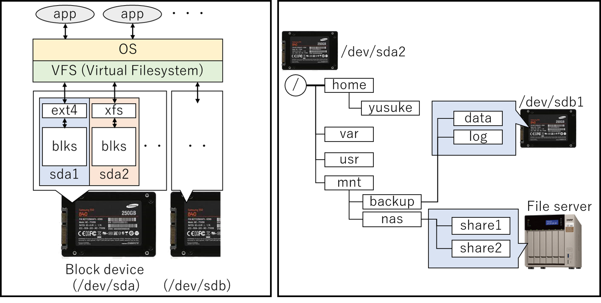

# Ubuntuの仕組み (short ver.)

## Introduction

現在主要なOSとして、メインフレーム系、Unix、Linux、Windows、及び、その派生系が存在する。Linuxには以下に示すような複数のディストリビューションが存在し、本トピックであるUbuntuはCanonical社がスポンサーをつとめるdebian系に属している。

- RedHat系 : RedHat Enterprise Linux (RHEL), Fedora, CentOS
- Debian系：Debian, Ubuntu
- SUSE系: SUSE Enterprise Linux, OpenSUSE

多くのLinux系OSでは、一定期間毎にリリースが行われ、古いバージョンはサポート対象外になっていく。Ubuntuの場合は19.10, 20.04, 20.10 ... と年２回の頻度でリリースされ、通常版のサポートは9ヶ月程度、偶数年4月のリリースだけが長期間サポート(Long Term Support, LTS)で5年程度であり、業務利用の場合はLTS版を採用することが一般的である。


Linuxは、中核部分のKernel、拡張機能のKernel module（デバイスドライバなど)、及び、その他のアプリケーションやライブラリから構成される。アプリケーション/ライブラリがデバイスアクセスなど特権を必要とする操作を行うとき、カーネルの機能を呼び出すことで操作を行う（System Call)。


#### 関連コマンド

```bash
$ lsmod      # 組み込み済みのカーネルモジュールを一覧表示
$ modprobe   # カーネルモジュールを組み込む
$ insmod     # 指定モジュールのみロード(modprobeなら依存関係も考慮してロード)
$ rmmod      # 指定モジュールのアンロード
```


## Boot sequence

起動シーケンス：

0. 電源ON
1. BIOS/UEFIがハードウェアを初期化後、ディスクに格納されたブートローダを実行
2. ブートローダはカーネルとinitramfsを読み込み、メモリ上に展開
3. initramfsは必要なカーネルモジュールをロード、ルートファイルシステムをマウント
4. initfamfsがsystemdを実行し各種サービスを起動
   a. udevが接続デバイスを認識し、/dev以下にデバイスファイルを生成
   b. ブロックデバイスを/etc/fstabに従いマウント
   c. ネットワークの設定、ソケットの起動
   ...etc


## Systemd

Linux内のSystem管理を行う仕組み。Ubuntuでは16からUpstartに代わり採用された。

#### 関連コマンド

```bash
sudo systemctl start xxxx.service    (起動)
sudo systemctl stop xxxx.service     (停止)
sudo systemctl restart xxxx.service  (停止⇒起動)
sudo systemctl reload xxx.service    (設定の再読み込み)
sudo systemctl status xxx.service    (サービス状態の表示)
sudo systemctl enable xxx.service    (起動時の自動実行ON)
sudo systemctl disable xxx.service   (  //         OFF)
```

#### ファイル構成

```
/lib/systemd/system/xxxx.service   (デフォルトの設定ファイル)
/etc/systemd/system/xxxx.service   (Overwrite用の設定ファイル)
```


## Device

デバイス管理ツール。デバイスドライバを介してデバイスを認識して、/dev以下にデバイスファイルを生成。

#### ファイル構成

```
/etc/udev/rules.d   (システム管理者向けのデバイス定義の置き場)
/lib/udev/rules.d   (パッケージによるデバイス定義の置き場)
```

自作ルール作る場合は、/etc/udev/rule.d/70-persistent-hogehoge という名前が多い気がします
(e.g. 70-persistent-disk, 70-persitent-net, ...)

#### ブロックデバイス

- ディスクデバイスのこと

- 表現：/dev/sda, /dev/disk/by-id, /dev/disk/by-uuid, /dev/disk/by-path 　など同じデバイスを複数の形式で表現

- 通常は、１つのディスクを複数のパーティションに分割し、別々の領域として利用
   　/dev/sda ⇒  /dev/sda1, /dev/sda2, ... 

- 関連コマンド：

   ```
   空き容量を表示
   $ df
   Filesystem     1K-blocks   Used     Available Use% Mounted on
   /dev/sda1        106858       4461   102398     5% /boot/efi
   /dev/sda2        9983232   1727756  8239092    18% /
   ```

   ```
   ブロックデバイスを一覧表示
   $ lsblk
   NAME    MAJ:MIN RM   SIZE RO TYPE MOUNTPOINT
   sda       8:0    0    10G  0 disk 
   ├─sda1    8:1    0   106M  0 part /boot/efi
   └─sda2    8:2    0   9.9G  0 part /
   ```

   ```
   $ blkid DEVICE                     # 指定デバイスのブロックIDを表示
   $ dd if=DEVICE of=DEVICE/FILEPATH  # ifで指定したデバイスをブロックレベルで読み込み、ofで指定した場所へ出力(※)
   　(※) 要ルート権限のため、通常はsudoをつけて実行
   ```

   

#### ネットワークインタフェースデバイス

- ネットワークカード（のポート部分）のこと
- 表現：/sys/class/net/eno1 のような表記

#### その他

```
$ lspci    # PCIデバイスを一覧表示
$ lscpu    # CPUの情報を表示
```


## Filesystem

ファイル管理システム。

- ブロックデバイスまま扱うのは大変なので、ファイルシステム(FS)を介してブロックデバイスに対してアクセス。
  

- ツリー構造でデータを管理。ルートFS ("/") のツリーに、他FSを"mount"して連結することで１つのツリー上に全FSを統合
  
  
- 起動時に/etc/fstabの設定に基づき、各ファイルシステムをマウント
  @ /etc/fstab

  ```
  UUID=xxxx   /         ext4   defaults    0 1   # UUID=xxxxのディスクを '/' へext4 mount
  UUID=yyyy   /boot/efi vfat   umask=0077  0 1   # UUID=yyyyのディスクを '/boot/efi' へvfat mount
  LABEL=aa    /mnt      ext4   defaults    0 1   # LABEL=aaのディスクを '/mnt' へext4 mount
  /swapfile   none      swap   sw          0 0   # /swapfileというファイルをスワップとして使用
  ```

- 関連コマンド

  ```bash
  $ mount                       # マウント状態を一覧表示
  $ sudo mount DEVICE DIR_PATH  # 指定ブロックデバイス(要フォーマット)を指定パスへマウント
  $ sudo mount -t cifs //IP/PATH DIR_PATH  # 指定サーバの共有フォルダを指定パスへcifsマウント
  ```

- 関連ワード

  - ext4: Linux向けファイルシステム
  - NTFS: Windows向けファイルシステム
  - CIFS/SMB/Samba: ファイル共有プロトコル、windows file serverはこれでアクセス
  - NFS: ファイル共有プロトコル、CIFSと比べシンプル

## Network

#### 関連ワード

- Default gateway / Default Route
  異なるネットワーク同士を接続するネットワーク機器。外部NWへの通信では、Default Gatewayとして設定したIPアドレス宛にパケットを送信。ネットワークインタフェース毎に設定可能で、複数のネットワーク接続時に未定義ネットワーク宛ての通信時にはDefault Routeとして設定したGatewayが使用される
  

- DNS (Domain Name System)
  名前解決サーバ。IPではなく文字列で宛先が指定されたときは、DNSに問い合わせてIPアドレスに置換してからパケットを送信
  (厳密には  DNSへの問い合わせ結果＋/etc/hostsの設定　からDomain NameをIPアドレスに置換)

- Proxy Server
  インターネット接続できない内部ネットワークのクライアントの代理として、外部ネットワーク接続するサーバ

    

- DHCP (Dynamic Host Configuration Protocol)
  IPアドレスを自動設定するための仕組み、DHCP: ONとしておけば、IPアドレスを指定しなくても（他機器と重複しない）IPアドレスを自動設定してくれ、DNSやDefault Routeも設定してくれる（DHCP serverの設定次第で）

#### 関連コマンド

```bash
$ ifconfig / ip    # ネットワーク情報の表示
$ ping IP_ADDRESS  # 指定IPへの導通確認（受ける側にICMP受信設定必要)
```

```bash
ルーティングテーブルの表示
$ route -n
Destination     Gateway         Genmask         Flags Metric Ref    Use Iface
0.0.0.0         192.168.1.1     0.0.0.0         UG    100    0        0 ens4      # Default Route
192.168.1.0     0.0.0.0         255.255.255.0   U     100    0        0 ens4      # 192.xx系はこっち
10.0.0.0        10.0.0.1        255.255.255.0   U     100    0        0 eno1      # 10.xx系はこっち     
```


## Application

#### Process / Thread

何らかのアプリケーションプログラムを実行すると、１つ以上のProcessが起動する。Processは1つ以上のthreadを生成し、スケジューラを介して各CPU coreへ割り当てることで、アプリケーションの操作を実現する。また、Processはfork()により別のプロセス(子プロセス)を生成し、独立した処理を子プロセスにて実行することができる。


#### Applicatioのコンパイルと実行

c言語で書かれたソースコードをコンパイルして実行ファイルを生成するとき、以下の種類のファイルが存在する。

- ヘッダファイル (.h) : 宣言だけを書いたファイル
- ソースファイル (.c)  : ヘッダファイルの各宣言の処理の中身を書いたファイル
- 静的ライブラリ (.a) : 複数のヘッダファイルとソースファイルから生成したオブジェクト(.o)をまとめたもの
  　　　　　　　　　  ライブラリとして使用するときに実行ファイルのコンパイル時に静的リンクする
- 共有ライブラリ(.so) : コンパイル時にはリンクされず、実行ファイルを実行するときに
                                        動的にリンクされる。プラグインなど実行時に選択する場合に適する


生成した実行ファイルを実行するときには２つの方法があり、パッケージでインストールしたアプリは前者、手元でコンパイルしたお試しアプリは後者で実行することが多い（個人の所感。。）

1. 環境変数 $PATH 以下に格納　⇒　実行ファイル名での実行が可能
2. 絶対パスを指定して実行ファイルを実行  
   

また、共有ライブラリを必要とする実行ファイルの場合には、以下のいずれかの方法で実行時リンクが必要である

1.  /etc/ld.conf, /etc/ld.conf.d/xxx.conf にて指定したパス中に共有ライブラリを格納
2. 環境変数  $LD_LIBRARY_PATH に指定したパスに共有ライブラリを格納
3. コンパイル時に -rpath で共有ライブラリの場所を指定


#### Signal

実行中のプロセスに指示を行う手段として、Signalという方法が存在する。
Signalを受信したプロセスは、事前に定義されたシグナルハンドラの処理を行うため、実行中に介入が可能である。
比較的よく使用するSignalには以下のものがある。

- SIGINT (2)  : キーボードによる割り込みシグナル (CTRL+C)
- SIGQUIT (3) : キーボードによる中止シグナル (CTLR+\\)
- SIGKILL (9) : 強制終了（シグナルハンドラでの対応不可能）
- SIGTERM (15) : 終了シグナル


#### 関連コマンド

```bash
$ ps aux   # 実行中プロセスとその情報を一覧表示、通常　ps aux | grep xxx という形でフィルタして表示
$ sudo kill PID  # 指定したPIDをもつプロセスをkill (デフォルト15番、 kill -9 xx とするとSIGKILLが飛ぶ)
```


## X window system (X11)

Unix/Linuxで標準的に使用されるウィンドウシステムのこと。X.orgが有名。
クライアント・サーバモデルで実装されており、ネットワーク越しにGUIアプリケーションを起動することも可能。


#### 関連ワード

- Display Manager (xdm, lightdm, gdm, kdm, ..) :
  ログイン時にX serverを起動し、ウィンドウシステムを構築するサービス

- デスクトップ環境 (Gnome, Unity, ...):
  Window Manager, Display Manager, terminal, graphical text editor ... などデスクトップに必要な一式を揃えた環境

  

## Package management

Ubuntuではパッケージ管理のコマンドとして、dpkgとaptが使用される。

#### dpkgによるパッケージインストール/アンインストール

dpkgコマンドでは、指定した.debファイルのインストール/アンインストールを行う。.debで必要なパッケージが未インストールの場合は失敗するため、必要な全.debファイルを同時に指定する、もしくは、順にインストールしていく必要がある。

```bash
$ sudo dpkg -i PACKAGE.deb (指定ファイルをインストール)
$ sudo dpkg -r PACKAGE     (指定パッケージをアンインストール、アプリにより生成されたファイルは残す)
$ sudo dpkg -p PACKAGE     (     //                   、 アプリに関連する全ファイルを削除する)
```

#### aptによるパッケージインストール/アンインストール

aptコマンドでは、パッケージリポジトリを参照して、依存関係も考慮した上で、インストール/アンインストールを行う。
以下の流れでパッケージリポジトリを登録して、インストール/アンインストールへ進む

1. ```sudo apt update```実行をトリガに、```/etc/source.list```, ```/etc/source.list.d/xx.list``` に指定されたURL先にある
   パッケージリポジトリを検索対象として登録する

2. （必要に応じて) ```wget http://xxxx/xxx.pub -O - | sudo apt-key add``` により、指定リポジトリの認証キーを登録
   ※認証キーのないリポジトリは信頼できないリポジトリとなり、インストール時に探索対象から外される

3. 以下のコマンドにてインストール/アンインストールを行う

   ```bash
   $ sudo apt install PACKAGE (インストール)
   $ sudo apt remove PACKAGE (アンインストール、生成ファイルは残す)
   $ sudo apt purge PACKAGE (アンインストール、関連する全ファイル削除)
   ```

   

## Appendix

#### リモートアクセス

コマンドラインで、ネットワークを介して別コンピュータへログイン

- telnet: 平文通信
- ssh: 暗号通信

リモートデスクトップ

- RDP: いわゆるWindowsのリモートデスクトップ
- VNC: プラットフォーム非依存のリモートデスクトップ

ファイル転送、どちらもssh経由でファイルを転送、sftpが推奨

- SCP: シンプル、高速。OpenSSHコミュニティから非推奨宣言（メンテ優先度(低)）
- SFTP: 高機能、転送の再開が可能
- (おまけ) rsyn:  ```rsync -e ssh ${USER}@${HOST_NAME}:FILE_PATH FILE_PATH```


#### スケジュール実行

- cron:
  定期的に実行する処理はここに登録。```sudo crontab -u USER -e```で設定変更可能。

