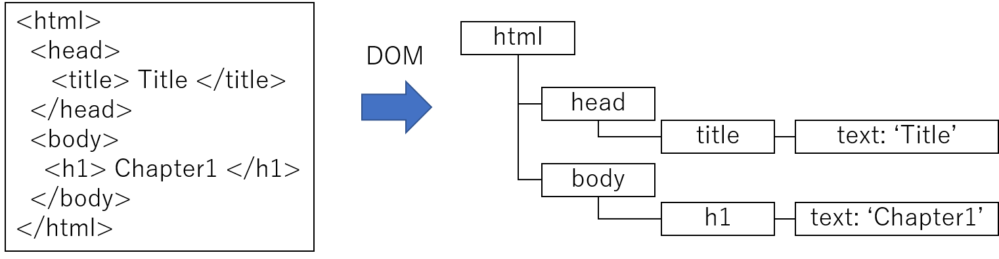
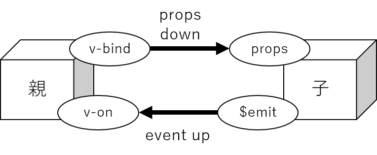

# Vue.js / Vuetify

### Reference

* Vue.js (v2.x) official document: https://v2.ja.vuejs.org/v2/guide/
* Vuetify (v2.x) (UI library): https://v2.vuetifyjs.com/ja/getting-started/wireframes/
* Material design icons library:
  *  https://pictogrammers.com/library/mdi/
  * https://pictogrammers.github.io/@mdi/font/1.1.34/
* Google coding style guilde: https://google.github.io/styleguide/jsguide.html


### Getting Started

```html
<!DOCTYPE html>
<html>

<head>
  <meta charset='UTF-8' />
</head>

<!-- Vue.js libraries -->
<script src="https://cdn.jsdelivr.net/npm/vue@2.6.1/dist/vue.min.js"></script>
<script src="https://cdn.jsdelivr.net/npm/vuetify@2.6.1/dist/vuetify.min.js"></script>
<link href="https://cdn.jsdelivr.net/npm/vuetify@2.6.1/dist/vuetify.min.css" rel="stylesheet">
<link href="https://cdn.jsdelivr.net/npm/@mdi/font@1.1/css/materialdesignicons.min.css" rel="stylesheet">

<!-- HTML body -->
<body>
  <div id="app">
    <v-app>
      <v-navigation-drawer v-model="drawer" app>
        Navigation Drawer
      </v-navigation-drawer>

      <v-app-bar app color="blue">
        <v-app-bar-nav-icon @click="drawer = !drawer"></v-app-bar-nav-icon>
        <v-toolbar-title>Application Bar</v-toolbar-title>
      </v-app-bar>

      <v-main>
        <v-container>
          This is a Vutify sample.
        </v-container>
      </v-main>

      <v-footer color="blue">
        Footer
      </v-footer>
    </v-app>
  </div>
</body>

<!-- JavaScript main -->
<script>
  Vue.use(Vuetify)

  var app = new Vue({
    el: '#app',
    vuetify: new Vuetify(),
    icons: { iconfont: 'mdi'},
    data: {
      drawer: false,
    },
    methods: {},
  })
</script>

</html>
```


###### 基本機能

###### 変数と関数

* アプリケーションで使用する変数は```data```に、メソッドは```method```に定義する
* HTML部分に変数を展開するには```{{変数名}}```と書く、
  同様に```{{メソッド名()}}```と書くとメソッドの戻り値が展開される
* メソッドから```data```内の変数や他のメソッドにアクセスするには、```this.変数名```/```this.メソッド名()```と書く

@HTML

```html
<v-main>
  <p> {{message}} </p>
  <p> {{getText()}} </p>  
</v-main>
```

@``var app`` in JavaScript 

```javascript
data: {
  message: 'This is a sample text.',
},
methods: {
  getText() {
      return 'text: ' + this.message;
  },
}
```


###### イベントの割り当て

* ボタンクリックなどのイベントをメソッドに割り当てるには、```イベント名="メソッド名()"```と書く
* ブラウザなどのコンソールへのデバッグ出力には、```console.info()```,```console.error()```などが便利
  (ブラウザ上でF12を押下すると出力表示用の窓が表示される)

@HTML

```html
<v-main>
  <v-btn @click="click()"> button </v-btn>
</v-main>
```

@``var app`` in JavaScript 

```javascript
methods: {
  click() {
    console.info('A buttuon is clicked.')
  }
}
```


###### 繰り返し

* 配列やオブジェクトの要素をループ文を使って表示するには```v-for```を使用する
* ```v-for="item in array"```
* ```v-for="(key, value) of object"```

@HTML

```html
<v-main>
  <ol><li v-for="item in array"> {{item}} </li></ol>
  <ol><li v-for="(name, value) in list"> {{name}}:{{value}} </li></ol>
</v-main>
```

@``var app`` in JavaScript 

```javascript
data: {
  array: ['apple', 'orange', 'banana'],
  object: {var1: 1, var2: 2, var3: 3},
}
```


###### 条件文

* ある要素の表示/非表示の制御には```v-if="条件式"```を使用する

@HTML

```html
<v-main>
  <p v-if="show"> Flag is true </v-if>
  <p v-if="!show"> Flag is false </v-if>
</v-main>
```

@``var app`` in JavaScript 

```javascript
data: {
  show: true,
}
```


* 次のように、```v-else-if```や```v-else```を使って複数の条件式を書くこともできる

@HTML

```html
<v-main>
  <p v-if="number==0"> Number is zero </p>
  <p v-else-if="number % 2 == 0"> Number is odd </p>
  <p v-else> Number is even </p>
</v-main>
```

@``var app`` in JavaScript 

```javascript
data: {
  number: 1,
}
```


### 事前知識

###### DOM

* Document Object Modelの略で、定義されたプロトコルに従い文書データをツリー構造のオブジェクトに変換するモデルのこと
* また、生成済みのDOMツリーにノードを追加する処理を```マウント```と呼ぶ
  (最初の例だと、```<div id="app">``` と書くことで、```el: '#app'```という情報を持つ```var app```をマウントしている)



###### ディレクティブ

* htmlタグには複数の属性を記述して付与することができ、```<div v-bind:arg.sync=value></div>``` では、
  ```v-bind```をディレクティブ、```arg```を引数、```.sync```を修飾子と呼ぶ(valueは値)


###### vueによるDOMの直接参照

* ルート要素(```<div id="app"></div>```の区間)へのアクセスには```$el```を使う
* refで要素に名前をつけると、```$refs```を使ってその要素へアクセスできる

@HTML

```html
<v-main>
  <p> A line without directive </p>
  <p ref="xxx"> A line with the ref directive </p>
  <v-btn @click="click()"> Click here </v-btn>
</v-main>
```

@``var app`` in Javacript 

```javascript
methods: {
  click() {
    console.info(this.$el)
    console.info(this.$refs.xxx)
  }
}
```


###### ディレクティブの適用に便利なhtmlタグ

文字装飾や属性付与のため、ディレクティブ適用だけしたいとき、以下のタグが便利である。

* ```<div>``` : division、複数行からなるブロック要素にディレクティブを適用したいときに使用。
                 ブロック要素の前後に改行が入る。
* ```<p>```: paragraph、行単位に適用したいときに利用、文末に改行が入る。
* ```<span>```: 文章の特定部分にだけ適用したいときに利用。改行は入らない。
* ```<h1> .. <h6>```: heading、見出し部分に使う。``` h1```がフォントサイズ最大で```h6```が最小、改行は入らない。

@HTML

```html
<v-main>
  <div v-if="show">
    <p v-for="item in array"> {{item}} </p>
    <p> number: <span v-for="item in array"> {{item}} </span> </p>
  </div>
</v-main>
```

@``var app`` in JavaScript 

```javascript
data: {
  show: true,
  array: ["apple", "orange"],
  number: 1,
},
```


### データバインディング

###### v-bind (属性のバインディング)

* 属性に変数値を設定するときには```v-bind```を使用する：
  ```v-bind:属性値=値```(```省略記法 :属性名=値``` )　

@HTML

```html
<v-main>
  <input type='text' v-bind:value="message">
</v-main>
```

@``var app`` in JavaScript 

```javascript
data: {
 message: "Default text",
}
```


* タグのclassやstyleのバインディングも可能
* 属性名にハイフンが含まれる場合はクォーテーションマークで囲む必要がある

@HTML

```html
<v-main>
  <i v-bind:class="myIconClass"> Airplane </i>
  <div v-bind:style="myStyle"> Styled text </div>
</v-main>
```

@``var app`` in JavaScript 

```javascript
data: {
  myIconClass: 'mdi mdi-airplane',
  myStyle: {'background-color': 'red' },
}
```


###### v-model (双方向データバインディング)

* フォームへの入力/フォームでの選択値の取得を同期させるときには```v-model```を使用する:
  ```v-model="変数名"```
* ```<xx v-model="message">```は```<xx v-bind:value="message" @input="message = event.target.value">```と等価

@HTML

```html
<v-main>
  <p> {{message}} </p>
  <p> <input type="text" v-model="message"/></p>
</v-main>
```

@``var app`` in JavaScript 

```javascript
data: {
 message: 'Default text',
}
```

* 修飾子として以下の利用が可能
  * ```.lazy```: inputイベントの代わりに、changeイベントを利用
  * ```.number```: 入力文字列を数字列に変換して値設定する
  * ```.trim```: 余分なスペースを削除して値設定する


###### テンプレート制御ディレクティブ

* v-pre: 変数展開などvueの処理を行わず、コードをそのまま表示
* v-text: ```{{}}```同様、変数を表示。```{{}}```記法がエスケープされて変数展開できない場合に使用
* v-html: textをhtmlとして読み込み表示
* v-once: バインディングを1度だけ行う
* v-cloak: 描画が完了するまで非表示にする（画面遷移時のチラツキ防止）

@HTML

```html
<v-main>
  <div v-pre> {{text}} </div>
  <div v-text="text"></div>
  <div v-html="text"></div>
</v-main>
```

@``var app`` in JavaScript 

```javascript
data: {
  text: "<ol><li>A</li><li>B</li></ol>"
}
```


### イベントハンドラ

###### メソッドイベントハンドラ

* イベントをメソッドに割り当てるには、```v-on```を使用する:
  ```v-on:イベント名=メソッド()```(省略記法：```@イベント名=メソッド()```)

@HTML

```html
<v-main>
  <v-btn @click="click()"> button </v-btn>
</v-main>
```

@``var app`` in JavaScript 

```javascript
methods: {
  click() {
    console.info("A buttuon is clicked.")
  }
},
```


###### 算出プロパティ(computed)

* ```computed```に定義した関数は```data```に定義した変数のように扱うことができる

  ```
  computed: {
    プロパティ名: function() { return 値; },  // 値取得だけのとき
    プロパティ名: {  // get/setなど複数操作がある場合
      get: function() { return 値; }
      set: fucntion(引数) { 処理 }
    } ,
  }
  ```

  なお、functionは省略して ```get: function(){}```⇒```get: () {}```と書いてもよい

* 演算をともなう変数の定義に適している

@HTML

```html
<v-main>
  <p> {{width}} x {{height}} = {{area}} </p>
  <p> {{width}} x {{ratio}} = {{height}} </p>
  <p> height: <input type="text" v-model="height"></input>   </p>
  <p> width: <input type="text" v-model="width"></input>   </p>
  <p> aspect ratio: <input type="text" v-model="ratio"></input>   </p>
</v-main>
```

@``var app`` in JavaScript 

```javascript
computed: {
  area: function() { return this.width * this.height; },
  ratio: {
    get: function() { return this.height / this.width; },
    set: function(value) {
      this.height = this.width * value;
    },
  },
},
data: {
  height: 1.0,
  width: 1.0,    
},
```


###### ライフサイクルフック

ref: [ライフサイクルフックダイアグラム](https://v2.ja.vuejs.org/v2/guide/instance#%E3%83%A9%E3%82%A4%E3%83%95%E3%82%B5%E3%82%A4%E3%82%AF%E3%83%AB%E3%83%80%E3%82%A4%E3%82%A2%E3%82%B0%E3%83%A9%E3%83%A0)

* created: 初期化時に実行
* mounted: マウント時に実行 (=DOMに追加されたタイミング)
* updated: 変数が更新されDOMに反映された時に実行
* destroyed: インスタンス(≒画面)が破棄された時に実行


@``var app`` in JavaScript 

```javascript
created: function() { console.info('created'); },
mounted: function() { console.info('mounted'); },
updated: function() { console.info('updated'); },
destroyed: function() { console.info('destroyed'); },
data: {...},
```


###### フィルタ

* ```{{変数名 | フィルタ名}}```と書くことで、変数の値をフィルタ処理した値を展開する
* ```{{変数名 | フィルタA | フィルタB}}```と複数のフィルタを適用することも可能

@HTML

```html
<v-main>
    {{price | localeFilter}}
</v-main>
```

@``var app`` in JavaScript 

```javascript
filters: {
  localeFilter: function(value) {
    return value.toLocaleString();
  }  
},
data: {...}
```


### カスタムコンポーネント

* Vue.jsでは、ある機能を持つUI部品をテンプレートとJavaScriptを１つのセットとして定義できる。

* template部分のルート要素は単一である必要がある

  複数の要素を並列で表示したい場合は、```<div></div>```等で囲み単一にする

* ```data```はオブジェクトを返す関数として定義する必要がある (```data:(){...}```とfunctionの省略は可)

* コンポーネント名にはケバブ記法(小文字をハイフンでつなぐ記法)を使うのが一般的

@ component.js (新規ファイル)

```javascript
Vue.component('sample-component', {
  template:`
  <p> {{message}} </p>
  `,
  data: function(){
    return {
      message: 'This is a sample component.',
    }
  },
})
```

@HTML

```html
<html>
...

<!-- Vue.js libraries -->
<script src="https://cdn.jsdelivr.net/npm/vue@2.6.1/dist/vue.min.js"></script>
<script src="https://cdn.jsdelivr.net/npm/vuetify@2.6.1/dist/vuetify.min.js"></script>
<link href="https://cdn.jsdelivr.net/npm/vuetify@2.6.1/dist/vuetify.min.css" rel="stylesheet">
<link href="https://cdn.jsdelivr.net/npm/@mdi/font@1.1/css/materialdesignicons.min.css" rel="stylesheet">

<!-- Project libraries -->
<script src="component.js"></script>

<!-- HTML body -->
<body>
  ...

  <v-main>
    <sample-component></sample-component>
  </v-main>
    
  ...
</body>
...
</html>
```


###### 親子間のデータ通信 



* 親⇒子　へデータを渡すとき
  * 親は```v-bind```でデータを渡せばよい
  * 子は```props```に受け取る変数名を定義し、それを使用し処理を実装する

@ component.js 

```html
Vue.component('sample-component', {
  template:`
  <p> {{message}} </p>
  `,
  props: ['message'],
})
```

@HTML

```javascript
<v-main>
  <sample-component v-bind:message="var1">
  </sample-component>
</v-main>
```

@``var app`` in JavaScript 

```javascript
data: {
  var1: 'This is a passed message',
}
```


* 子⇒親　へデータを渡すとき
  * 親は```@イベント名=メソッド()```でイベントハンドラを登録する
  * 子は```$emit```を使用して登録されたイベントハンドラを発火する:
    ```this.$emit(イベント名、引数1、...)```

@ component.js 

```html
Vue.component('sample-component', {
  template:`
  <v-btn @click=click()> button </v-btn>
  `,
  methods: {
    click() {
      this.$emit('my-event', 'The component button is clicked.');
    },
  }
})
```

@HTML

```javascript
<v-main>
  <sample-component @my-event="update">
  </sample-component>
</v-main>
```

@``var app`` in JavaScript 

```javascript
methods: {
  update(value) {
    console.info(value);
  },
},
```


###### 双方向データバインディングを使ったデータ通信

* 双方向データバインディングを使うことで、変数１つで双方向のデータ受け渡しを表現できる
* ```v-bind.sync```を使う方法、もしくは```v-model```を使う方法により可能
  * ```v-bind.sync```:修飾子.syncを付けるだけで、あとは通常のv-bindと同様でかなり便利。(Vue3.0で廃止予定な点だけ注意)
                              子は```this.$emit('update:変数名', '値')```と指定することで値を送ることができる
  * ```v-model``` : Vue2.0では指定できる変数は１つのみ、
    前述のとおり```<xx v-model="message">```は```<xx v-bind:value="message" @input="message = event.target.value">```として動作する

(v-bind.sync方式)

@component.js

```javascript
Vue.component('sample-component', {
  template:`
  <div>
    <p><v-btn @click=click> button </v-btn></p>
    <p> Input: 
      <input type="text"
        v-bind:value="message"
        @input="$emit('update:message', $event.target.value)"
      />
  </div>
  `,
  props: [ 'message' ],
  methods: {
    click() {
      this.$emit('update:message', 'component.js')
    }
  }
})
```

@HTML

```html
<v-main>
  message: {{message}}
  <sample-component v-bind:message.sync="message">
  </sample-component>    
</v-main>
```

@``var app`` in JavaScript 

```javascript
data: {
  message: "index.html",
},
```

(v-model方式)

@component.js

```javascript
Vue.component('sample-component', {
  template:`
  <div>
    <p><v-btn @click=click> button </v-btn></p>
    <p> Input:
      <input type='text' v-model='message'/>
  </div>
  `,
  props: ['value'],
  computed: {
    message: {
      get() { return this.value; },
      set(v) { this.$emit("input", v); }
    }
  },
  methods: {
    click() {
      this.$emit('input', 'component.js')
    }
  }
})
```

@HTML

```html
<v-main>
  message: {{message}}
  <sample-component v-model="message">
  </sample-component>    
</v-main>
```

@``var app`` in JavaScript 

```javascript
data: {
  message: "index.html",
},
```


###### スロット

* 親から子の内部に別のコンポーネントを挿入するには```<slot></slot>```を使用する

@component.js

```javascript
Vue.component('comp1', {
  template:`
  <div>
    <p> header </p>
    <p> <slot></slot> </p>
    <p>  footer </p>
  </div>
  `
})
```

@HTML

```html
<v-main>
  <comp1>
      This is a inserted sentence.
  </comp1>
</v-main>
```


###### 複数のコンポーネントを組み合わせる

並べる：

 @ component.js

```javascript
Vue.component('comp1', {
  template:`
  <div style="background-color:red;">
  aaa
  </div>
  `
})
Vue.component('comp2', {
  template:`
  <div style="background-color:blue;">
  bbb
  </div>
  `
})
```

@HTML

```html
<v-main>
  <comp1></comp1>
  <comp2></comp2>
</v-main>
```


ネストする：

@component.js

```javascript
Vue.component('comp1', {
  template:`
  <div style="background-color:grey;">
  header
  <slot></slot>
  footer
  </div>
  `,
})

Vue.component('comp2', {
  template:`
  <div style="background-color:skyblue;">
  body
  </div>
  `
})
```

@HTML

```html
<v-main>
  <comp1>
    <comp2></comp2>
  </comp1>
</v-main>
```


### コンポーネントのスニペット集 (Vuetify提供コンポーネント+HTML提供フォーム)


### その他の機能

###### watcher(変数の監視)

@HTML

```html
<v-main>
</v-main>
```

@``var app`` in JavaScript 

```javascript
data: {

}
```


###### カスタムディレクティブ

@component.js

```javascript

```

@HTML

```html
<v-main>
</v-main>
```

@``var app`` in JavaScript 

```javascript
data: {

}
```

